# BoardDock

**Dock any PCB. No screws. No supports.**

BoardDock turns a PCB design, or a few measurements, into 3D-printable holders:
- It fits a light frame holder around each board's parts, holes and plugs.
- It docks every holder onto DIN rails, horizontal or vertical, and turns each board so every plug stays reachable.
- Boards stack: a HAT or shield bolted on its standoffs, or a separate board on a printed layer.
- A button on top of each holder releases the board; a press-down lever releases the dock from the rail.
- Printed table stands hold the rails. Cables between the boards are routed clear of everything, sized and combed automatically.
- The 3D view walks you through the assembly one step at a time, in the order you would really do it.
- Come back later to add a board: the rest of the rack stays where it is, and Export gives you only the new parts, cables and rails.

Everything is checked with FEA and packed onto as few print plates as possible.

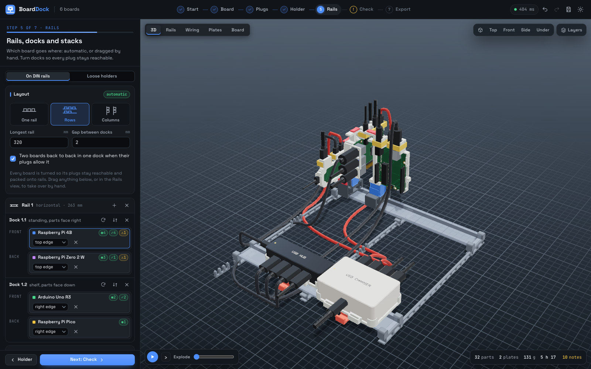

- **Imports:** KiCad, Altium (via STEP or Gerber), Eagle (new XML and old binary boards), board-viewer files, IDF, DXF, Gerber + drill + pick-and-place, and the neutral formats Allegro, OrCAD, PADS and Xpedition export: IPC-2581, ODB++ and GenCAD.
  - You can also draw a board by hand or start from a template.
- **Hole wizard:** sorts every hole into mounting holes (they get pins), connector pegs, part leads and stacking standoffs (kept clear, with room underneath). You can change any of them.
- **Fits holders automatically:**
  - **Frame** style (default): a rim round the board, corner guards, edge seats, and ribs laid out as a minimum spanning tree to every pin. It uses 25–50% less plastic than a full tray. The **tray** style is still there.
  - **Spring clips** at the board's edges that click over it and then carry no load, or snap pins in its mounting holes: Auto picks what fits.
  - Clearance for the board's underside, openings for every plug.
- **Protects plugs:** each connector gets a cradle that carries the mating plug's body, so a knocked cable loads the holder, not the solder joints. A snap-on cap locks the plug in.
- **Builds panels:**
  - Any number of rails, each horizontal or vertical.
  - Docks that turn four ways and take two boards back to back.
  - Stacks of boards on one dock.
  - One rail, rows or columns, laid out automatically, with boards that are cabled together kept next to each other. Then drag boards between slots, rails and stacks in the rack tree, or in the Rails view.
  - Boxes such as USB hubs, USB chargers and power boards, on their own rail. You set how many ports they have, of what type, on which face (top included), what each one is for, and exactly where each one is and which way up (a USB-A on its side, upside down), so a box can match yours to the millimetre. Or build one from scratch.
  - **Table stands:** printed sleepers across the rails, with cable combs.
- **Cables:** Auto-connect works out which plug goes where (power, USB host, hub and device ports) and says when you are short of hub or charger ports. You can connect plugs by hand in the Wiring view. Every cable is routed clear of the holders, boards, docks, rails and stands, and sized to a standard length you can buy.
- **3D view:**
  - Boards show copper traces, vias, silkscreen, parts and plugs. The traces are real for KiCad files and decorative for other boards.
  - Click anything (a board, a dock, a rail, a cable, a table stand, or one feature of a holder such as a cradle, cap, pin or spring clip) to see it and edit it.
  - Shift-click to pick several, then Delete to remove them all in one undoable step.
  - Play the assembly step by step, or pull it apart with the explode slider.
- **Checks:** hand calculations for every snap, plus 2D FEA of the dock's springs (the socket latch and the rail shoe hinge) for your material. A printability check finds every overhang and bridge; the print view can paint them.
- **Easy to correct:**
  - Switch cradles, caps, tie anchors, guards or labels off for a whole holder, choose clips or pins, or remove single features in 3D.
  - Hide small parts, ignore holes, strip plug protection, or revert to the import, for one board or all of them.
- **Efficient:**
  - Only changed holders are rebuilt, and the 3D view keeps its compiled shaders between edits (it used to compile them all again, a freeze of seconds). The header says **Rendering…** while a new look is being prepared.
  - Sturdy, balanced and lean presets; duplicate a board.
  - A tongue-fit tolerance and a 30–40 minute test-fit kit to print before the real thing.
- **Exports** binary STL or 3MF, one file per print plate, packed onto your printer's bed.
- **Open source** (MIT). It runs in the browser or as a desktop app for Windows, macOS and Linux.

## Download

| | |
|---|---|
| **Desktop app** | [Releases](https://github.com/danmover/boarddock/releases): Windows installer or portable `.exe`, macOS `.dmg`, Linux `.AppImage` / `.deb` |
| **Web app** | [danmover.github.io/boarddock](https://danmover.github.io/boarddock) (nothing is uploaded; all processing runs in your browser) |
| **From source** | `npm install` then `npm run dev` (see [Development](#development)) |

The desktop builds are not code-signed yet:
- On **macOS**, right-click the app and choose **Open** the first time.
- On **Windows**, choose **More info → Run anyway**.

## Quick start

1. **Start:** the middle of the window has three ways in: **drop your board's files** (several at once is fine: each becomes a board), **draw your own** (shape, size, holes, and a photo of it if you like), or **open a saved rack**. Below them is the library, every board and accessory with a 3D picture, on shelves (Raspberry Pi, Arduino and ESP32, hubs and chargers, powerboards, probes and adapters, My boards…), with a search. Click a tile to add it now, or **+** on several and **Add N boards** puts them all in as one undo step. With a rack open, Start says what it is and how far along it is, and the sidebar is a checklist of the steps (boards, cables, rails, check notes, what's left to print) you can click through. Later, **+ Board** in the top bar (or the **A** key) opens the same library from any step; a second Pi 4B is named "Raspberry Pi 4B #2" (the # so it never reads like a product name, such as a Pico 2), so every list, label and cable says which one. On a phone the library is the whole Start page and the four-step explainer folds away; Redo, Save, New rack and the theme are under **⋯** in the top bar, the board editor's toolbox starts closed, and picking a part closes it so you can tap the board to place it. To take a board out, use **Remove** on its card in the Board step (or right-click its chip); Undo brings it back.
2. **Board:** check the outline, parts and the hole wizard; fix anything in the board editor.
3. **Plugs:** pick the plug type and size for each connector, and what each one is cabled to (or press **Auto-connect**).
4. **Holder:** frame or tray, a preset, where the release button goes, and the features you want.
5. **Rails:** BoardDock has already placed every board on a rail. Pick one rail, rows or columns; drag, turn, pair or stack boards if you like.
6. **Check:** failing checks come first (each with **Show in 3D**); tap the passing / to look at / failing tiles to see only those. The boards' template reminders ("measure yours") are folded away at the bottom: tick each off with **Done** once you've done it (on the board card too); the perfboard's "measure the holes" reminder ticks itself off when you move, resize, add or remove one of its holes (not when you only reshape the board). Run the dock FEA for your material. The Start page, the step bar and the 3D view's stats all count the same way, and the step bar only flags failing checks.
7. **Export:** download the plates and print them in PETG. The shopping list has the rail lengths, the cables (length and plug types; jumper wires by the wire; what comes with a part, like a probe's ribbon or a plug pack's lead, is listed as not to buy), straps and standoffs. The Plugs step's **Cables to buy** is the same list. The download's README has the assembly steps.
8. **Build it**, following the play button in the 3D view. Then press **Mark the rack as built** in Export.

Every step has **Back** and **Next** at the bottom of the sidebar.

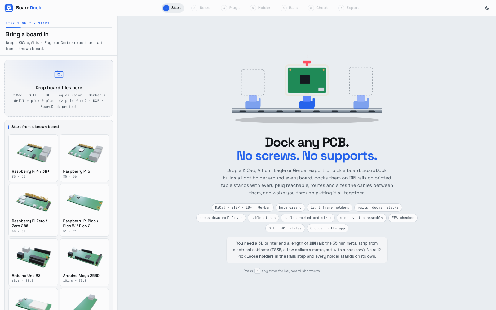

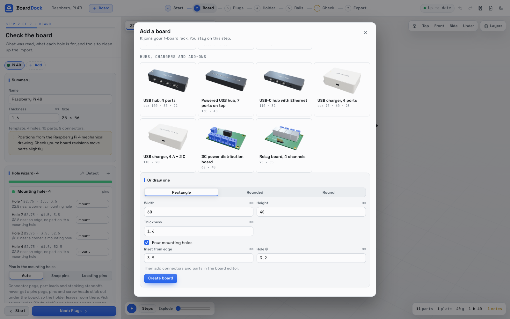

## The dock

Every board sits in a holder that plugs into a dock on the rail. This is the screwless "DIN hub" design, built into the generator:

| Part | What it does | Prints |
|---|---|---|
| **Rail shoe** (graphite, red lever) | Clips onto a TS35 rail. Its jaw wraps round the rail flange and hangs from a hinge leaf directly **above** the lip, so pulling the dock straight up can't pry it open. **To remove it:** lift the boards out, press the ridged red pad beside the socket down about 8 mm, and lift the dock off. The lever is printed in place on a pin; its hook pulls the jaw off the flange and the jaw spring lifts it back. A built-in stop protects the hinge. The lever goes on whichever side of the rail has more room; you can flip it per dock. | on its end face, lever and all |
| **Socket** (blue) | Snaps into the shoe in any of four 90° turns and takes two holders back to back. It has two print-in-place latches. | on its end face |
| **Holder** | The frame (or tray) around your board, with a tongue on its dock edge and a spine that carries the release rod. | flat on its back |
| **Release rod** (red) | Its head is the **button on the holder's top edge**: a keycap with a shallow thumb dish, rounded corners and chevrons that point the way it moves. It uses 11% less plastic than the old square button. Press it and the rod's 45° foot wedges the latch open. The latch spring returns it. The grip bar under your fingers has a matching finger scoop. | flat |

**Using it:**
1. Hook the shoe under the rail and press it down until it clicks.
2. Press the socket in, in whichever turn you want.
3. Push the holder straight down into the socket until the latch clicks.
4. **To take a board out:** put your thumb on the red button and two fingers under the grip bar, squeeze, and lift.

**Where the release button goes** (Holder step, per board):
- **Centred** (the default): the button sits in the middle of the holder's far edge, and the spine that carries its rod runs under the board, which sits about 10 mm up.
- **Beside the board:** the spine, grip bar and button run beside the board, so the board sits low and the far edge stays free for plugs.
- **Automatic:** whichever keeps the plugs clear with the least plastic.

Plugs always win: if the button would block one, it moves.

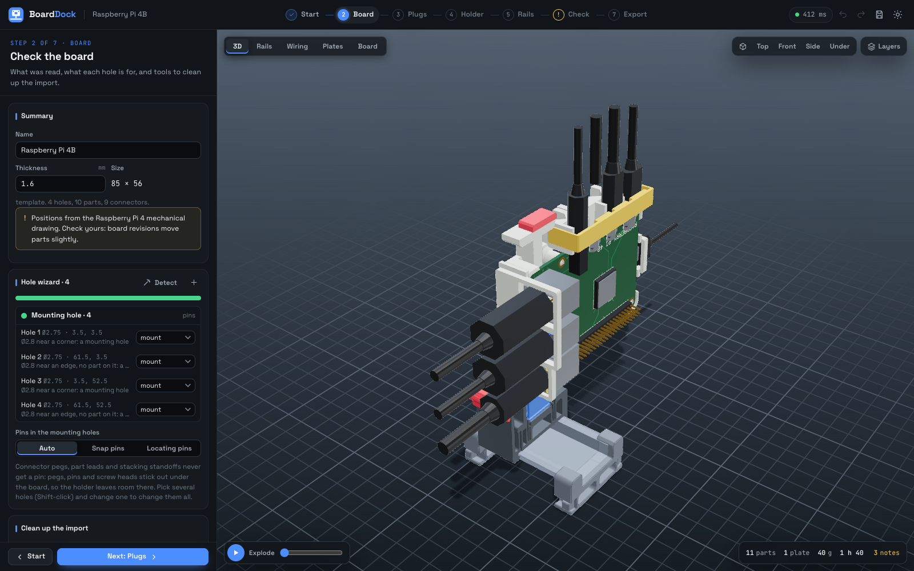

### Lying flat

A board can also **lie flat on its dock**, top face up (out of the wall), on the same shoe and socket:
- Its holder has a tab, the **ear**, on one edge, flush with its underside, so the holder prints base-down like any other.
- The tongue that plugs into the socket is a small **dock key** of its own: the standing holder's pedestal and tongue, with a dovetail on top. It prints lying on its side (its tongue flat, its layers running along it, as a standing holder's tongue does), slides into a dovetail groove under the ear from the ear's tip, and the release rod locks it in: the rod goes in from the top, through the ear and the key, down to the socket's latch. The same socket and latch hold it as hold a standing holder.
- The release button sits on top of the ear, clear of the board. To take the board off, put your thumb on the button and your fingers under the ear, then squeeze and lift. The rod prints lying down.
- Two boards can lie **back to back** in one socket, ears together, reaching opposite ways. A J-Link or serial adapter can **stand** in the other half of a flat board's socket. The shoe's release lever goes on the side away from a flat board where it can.
- The ear goes on an edge where it keeps clear of the plugs, as near the middle as it can.

**Rails › Boards in their docks** sets it for the whole rack:
- **Stand up** (the default) takes the least rail.
- **Lie flat** stands far less out of the wall (a Pi, Uno, Pico and ESP32 rack: about 72 mm instead of 163 mm), and headers point straight out at you, but each board takes its width of rail.
- **Whichever suits each** lays a board flat only where that keeps its plugs clearly easier to reach.

Each slot also has its own **stands / lies flat** toggle in the Rails list and in the dock's inspector. Check lists the tongue's stress under a 20 N press on the far side of a flat holder (the same load case as a push on a standing holder's far edge). None of this has been printed yet.

## The holder

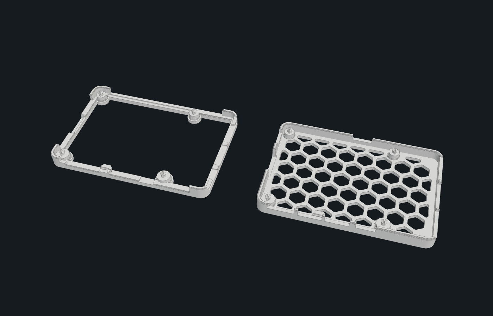

**Frame** (the default) combines the lean spine-and-rib carrier of the original DIN hub with the tray's protection:
- a rim runs round the board, under its edge and out to the holder's outline;
- short corner guards locate the board, and **edge seats** carry it wherever no pin is close;
- ribs, laid out as a minimum spanning tree, tie every pin to the rim or to the dock's spine;
- plug cradles, caps, guards, tie anchors, spring clips and the label each bring only the bit of wall they need.

**Tray** is the full base with a hex pattern and a wall all round: stiffer, and more plastic. The style cards show your own board's holder in each style, in 3D.

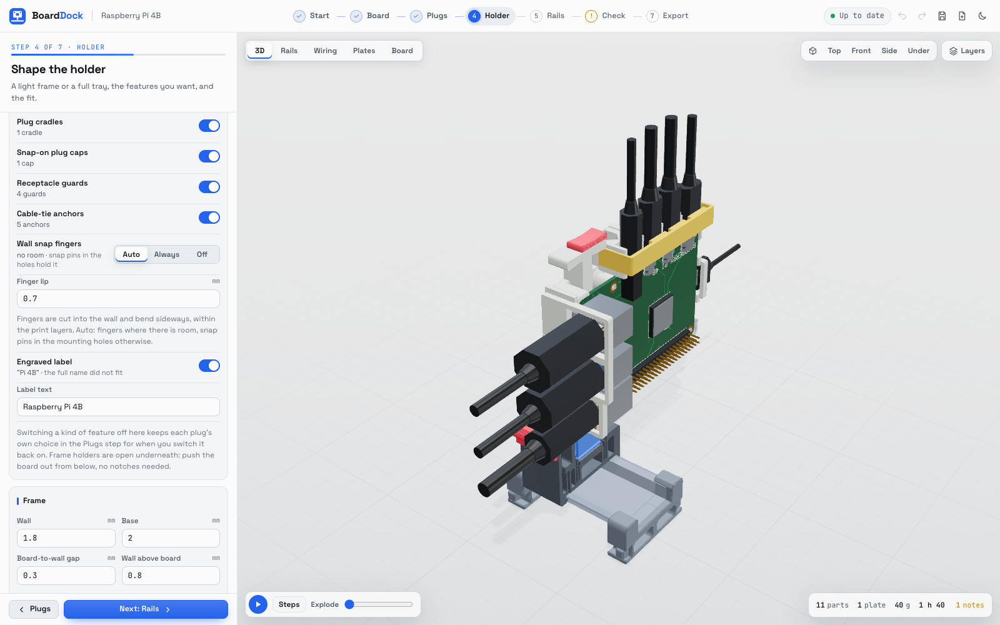

**Features** has one row per feature with what this holder actually got, so a switch never just silently does nothing:
- plug cradles, caps, receptacle guards and cable-tie anchors, with how many (caps clip onto cradles, so they need them);
- **Hold the board with**: Auto / Clips / Pins / Both, and a **clip strength** (Firm or Gentle); see *How the board is held* below. It says what the board got ("2 spring clips", "4 snap pins") and, when clips don't fit, why;
- **engraved label**: the board's name by default. If it doesn't fit a free wall it is shortened to a form that still says which board it is ("Raspberry Pi 4B" becomes "Pi 4B", "Raspberry Pi Zero 2 W" becomes "Pi Zero", never just "2 W"). Your own words are never cut. It only gives way to the spring clips if that actually gives them room, and never on a board held by pins;
- finger notches on trays (a frame is open underneath: pull a clip back and push the board out from below).

The **release button** section says where the button went: when a plug would be in the way of the place you asked for, it names the plug.

### How the board is held

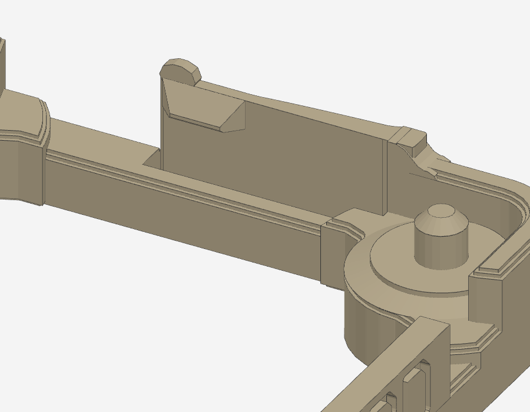

**Spring clips** (the default wherever they fit). Each clip is a leaf standing straight up from the print bed at the board's edge, as tall as the holder there. It is joined to a short block of wall (its anchor) along its whole height, with a generous rounded root, and cut free of everything else by 0.6 mm slits, so it bends sideways, within the print layers, the strong way for a printed part.
- **The leaf tapers** from about 1 mm at the root to 0.7 mm at the tip (thickness following the square root of the distance from the load), so the bending strain is spread along it instead of piling up at the root: about 40% less peak strain than a straight leaf pushed as far.
- **The lip** at its tip has a 35° entry ramp, so the board's edge pushes the clip aside easily; a flat ledge over the board's edge that holds it down; and a small ear on top to hook with a fingernail.
- **Nothing loads it once the board is in.** The ledge sits on the first layer line above the board (0.15 to 0.35 mm clear of it), and the leaf stands 0.1 mm further out than the guards, so the board never leans on it. A clip only strains while the board goes past, so it can't creep or take a set.
- **Sized for a feel, inside the limit.** Each clip is made as thick as gives about 3.5 N of push-back (**Firm**) or 1.6 N (**Gentle**), but never more than 55% of the material's strain limit in the worst case (the board pressed hard against that side as it goes in). For PETG that is about 1.1% strain at most against a 2% limit; a 14 mm clip on a 60 × 40 mm board works at 0.7%. A taller holder (a docked board stands higher) gets a thinner leaf for the same feel.
- **Anti-rattle springs:** thinner leaves (0.8 to 0.6 mm, 14 to 16 mm long) whose lip has a 45° face resting on the board's top edge. Pushed 0.3 mm aside, they press the board across against the guards opposite and down onto its seats with about 0.2 N each (as much again down as across), at 0.12 to 0.17% strain (under 0.25% with a board 0.15 mm oversize). That is low enough that creep only slowly eases the push; it never lets go. One goes across the clips and one along them, where the edges have room.
- **Where they go:** a clip takes a straight (or gently curved) stretch of edge about 17 mm long (3 mm anchor, 14 mm leaf) clear of plugs, the dock, the label and parts at the edge. Clips come in pairs facing each other across the board, placed so the line between them splits the board (it can't tip out about that line); a big board gets a second pair. Round and L-shaped boards get them too. Where plugs crowd the edges, **short clips** (10 mm, thinner, a shorter lip) go in the gaps; where even those don't fit, snap pins hold it; and if neither can, the Check step says **"Nothing clips this board in"** and what to change.
- **Taking it out:** pull one clip's ear back with a fingernail and lift that side; the other side then slides out from under its clip.
- **Printing:** every leaf stands on the bed, so the only overhang in a clip is its ledge, about 0.9 mm out from the leaf, printed flat (the Check step measures it). Nothing else in a clip leans or bridges.

**Snap pins** in the mounting holes are the other way: split pins with a barb, their split ending in a round (not a sharp corner) so the legs' strain doesn't pile up at its root. They bend across the layers, so their strain is judged 30% more strictly.

**Hold the board with** (Holder › Features):
- **Auto** (the default, and what a pile of imported boards gets): clips where two fit facing each other, short clips between plugs next, snap pins last. Across the library that gives clips on the Pico, Nano, ESP32, perfboard and the blank board (and the examples, except where a dock takes the edge they need); short clips on the Uno and Mega (snap pins when they stand in a dock, where the dock takes an edge); snap pins on the Raspberry Pis, whose edges are all plugs and headers.
- **Clips**: clips only (snap pins only if no clip fits); **Pins**: snap pins only; **Both**: clips and snap pins.
- **Clip strength**: Firm (about 3.5 N a clip) or Gentle (about 1.6 N).

The Check step lists, for each board: the clips' strain going in and its margin under the material's limit, the strain at rest (0 for the clips, the anti-rattle springs' preload), a rough force to press the board in (a 60 × 40 board with two clips and a spring: about 8 N), and that they print with no supports. The forces are beam sums with a textbook modulus: a print will tell the real feel and the click. Projects saved with the old wall-finger setting keep working (fingers Off reads as Pins, Always as Clips).

Plastic in a holder with no cradles or clip:

| Board | Frame | Tray |
|---|---|---|
| Raspberry Pi 4 | 4.0 cm³ | 7.8 cm³ |
| Arduino Uno | 4.3 cm³ | 7.2 cm³ |
| Perfboard 50 × 70 | 4.7 cm³ | 6.8 cm³ |
| 60 × 40 blank | 4.4 cm³ | 5.8 cm³ |

Cradles, caps and the dock tongue come on top of these and are the same for both styles.

## Drawing a board

The Board step is a 2D editor for any board: one read from a file, one from the library, or one you draw from nothing. It draws the board the way it looks: the solder mask in the board's own colour, copper tracks a shade lighter under it (its own, from a KiCad file; otherwise plausible ones drawn in from each plug to the main chip and between neighbours, with vias and a row of stitching vias: **Tracks** hides them, and nothing is made from them), part shadows as long as the parts are tall, chip legs, tinned ends on resistors and capacitors, header pins with pin 1 square, what each pin is for (GND, TX, RX…) printed beside it, references in the silkscreen, and the board's name in a free corner.

- **The toolbox** is docked on the left (**T** shows or hides it): every plug, header, debug connector, hole and tall part as a picture of it on a scrap of board, in groups (USB and power; video, network and audio; headers and wires; debug and serial; holes; parts that stand tall), with a search. Click one and it follows the pointer, snapping to the nearest edge if it is a plug, then click where it goes (Shift keeps placing); or drag it onto the board.
- **Snapping:** dragging parts or holes snaps them to the board's edges and middle and to the other parts' sides and centres, with a guide line, and shows how far they are from the nearest edges. Alt drags freely; the arrow keys nudge.
- **The board check** under the board's card says what, as drawn, would spoil its holder, each with a fix: a hole off the board, so near an edge the pin under it would hang off, under a part, or there twice; a plug whose mouth sits back from the edge (a plug can't reach it through the holder's wall: **Move it to the edge**) or faces into the board (**Turn it round**); a part off the board, two on top of each other; a thickness no board has. **Fix all** does the safe ones in one undo step. A real board's holes are never moved: one in the wrong place is left out. A board with no holes is held by its clips; if you are making it yourself, **Add corner holes** puts M3 holes where they fit.
- **Plug labels** (J_PWR, USB-C, HDMI0…) are printed on the board just inside each plug on an edge, in 2D and 3D, turned along the edge and clear of each other, so a plug never hides its own name. Zoomed out they stay big enough to read wherever there is room.
- **Click any dimension** to type what you measured, right where its label is: the board's **width** and **height** (the board stretches, its right side or top moving), and every dimension you put in. The width and height labels slide along their lines off any plug's opening, so neither sits on a plug.
- **Measure** (**M**) puts a dimension between two features: an edge of the board, a corner of its outline (on an odd shape), a hole's centre, or a part's centre or one of its sides. Type what your calipers read on the real board and the part (or hole) moves to it; a hole takes the holes in line with it along (the rest of its row or column), so a pattern stays square (untick it to move just the one); between two edges it sets the board's width or height. Dimensions stay on the board and follow what they measure. They lay themselves out so no two lie on top of each other (a short one puts its value beside it, as on a drawing). **Drag a label** to put it where you want it: across its line moves the line, along it slides the value (past the ends too). Let go on top of another and it steps aside to the nearest free place. Click a label to type the value; **Put back** and **Tidy all** hand the placing back to BoardDock.
- **Photo:** put a photo of the real board under the drawing, scale it from two points and the distance between them, line it up by a point on it, and trace the parts over it.
- Hover anything for what it is: its size, height, side, position, which way its plug goes in, what a hole is for, and how far it is from the left and bottom edges.
- The sidebar has the board as a card (its 3D picture, size, thickness, holes and plugs; **In 3D**, **Save to My boards**, **New version…**) and tabs: **Parts** (by what matters: plugs, tall parts, parts underneath, each with its picture), **Holes** (and **Add four holes** by spacing), **Headers**, **Board** (what it is: a board, or a debug probe or USB-serial adapter you drew yourself; those slide into the slot behind the board they serve, like the built-in J-Link and FT232RL), and **Box** for a box.
- **Draw your own** (on Start, or in **+ Board**): a rectangle, a rounded one or a round board; its size, corners and thickness; holes at the corners (so far in from each edge) or by their spacing (a Pi's are 58 × 49 mm apart), checked to fit; and a photo to trace over. **More shapes** has the ones odd boards often are: L-shaped (the size of the corner taken out), a notch in the middle of an edge, a corner cut off (one or all four), a polygon (3 to 16 sides) and a round board with a flat; the preview follows as you type, and the corner holes go in each corner that has room. **Your own** opens straight in the Shape tool's Line mode to draw the outline corner by corner. Each opens in the editor for its plugs and parts.
- **Save to My boards** keeps the board (or box) in this browser; the library's **My boards** shelf lists them for any rack.
- **On a box**, what you do in the editor sticks: drag a port (or nudge it, or type a dimension to it) and it stays exactly there, on its side; drag a side port over to another side and it moves onto that side; delete one and it leaves its row; put a plug on it from the toolbox and it becomes a port of the box. A dimension between two edges sets the box's length or width.
- **Shape** (**S**) changes the board's outline and its cut-outs, for boards that are not a plain rectangle. A bar under the drawing has three ways to work:
  - **Edit:** drag any corner, or drag an edge to slide it straight out or in. Hover an edge to see its length. Click the **+** in the middle of an edge to add a corner there (drag it to make a V straight away). Select a corner to type its X and Y, round it (a fillet) or cut it off straight (a chamfer) by the size you type, or press Delete to take it out. Select an edge to type its length (its far end moves; a square side slides out with it) or bend it into an arc of the height you type. With nothing selected, **Round** or **Cut** does every corner at once.
  - **Line:** click corners one after another and click the first one to close the shape (Enter closes it too). Shift keeps each edge to 15° steps. Type a length (and an angle: 0° is to the right, 90° up) and press Enter for an exact edge, as in a CAD program: start typing a number on the drawing and it goes into Length. **Arc** (or A) makes the next edge a three-point arc: click where it ends, then a point it passes through. Backspace takes the last corner off. The closed shape is **added** to the board, **cut out** of it (a notch where it crosses the edge, a cut-out where it is inside), or becomes a **new outline**.
  - **Shapes:** a rectangle, circle or slot of the size you type, clicked in where it goes, or dragged out (a rectangle corner to corner, a circle from its centre, a slot from one end to the other). Each is added to the board or cut out of it.
  - Everything snaps, with the same guide lines parts get: the grid, the other corners' x and y, the board's edges and middle, the parts and holes, 15° from the neighbouring corners (and where two such lines meet, for a square corner), and the other edges. Alt snaps nothing.
  - A board stays one piece with no edges crossing: an edit that would make one cross another, cut the board in two, or add a shape that does not touch it is refused, and says why. Holes and parts a new shape leaves off the board (or on its edge) are ringed in red, with a note, until you move them. Each edit is one ⌘Z.
## Hole wizard

Not every hole is for mounting. The wizard sorts them when a board comes in, and you can change any hole or group:

| Kind | Found by | The holder |
|---|---|---|
| **Mounting hole** | no part on it, near a corner or edge, 2.2–4.5 mm | puts a locating or snap pin through it |
| **Connector peg** | inside a connector's body (RJ45 pegs, USB shell tabs, jack pins) | leaves it free, with a pocket underneath |
| **Part lead** | inside a part, or in a row at header pitch | leaves it free, with clearance for the leads |
| **Stacking standoff** | lines up with a hole of a board bolted on top | leaves it free, with room for the screw head or nut |
| **Ignored** | set by hand | does nothing |

The board editor colours every hole by its kind.

## Stacks

A board can sit on top of another; the bottom one carries the dock. In the **Rails** step, drag a board onto another board, or pick **on top of…** in Stacks. There are two kinds:
- **Bolted on standoffs:** a HAT on a Pi, a shield on an Arduino. The top board is lined up on the holes the two boards share (for example the Pi's 58 × 49 pattern), and shown on standoffs of the length you set (11 mm by default). The shared holes of the bottom board become stacking standoffs in the hole wizard: no pins there, and room underneath.
- **Printed layer:** a separate board gets its own light holder that presses onto four corner towers on the holder below, with press-fit pegs. The towers on a docked holder stay back from the dock face.

Bolted is chosen automatically when at least two holes line up; you can switch it. Only sensible targets are offered: boards about as big or bigger, the ones it bolts onto first, and never a hub, charger or powerboard (a J-Link only on another J-Link of the same board).

## The panel

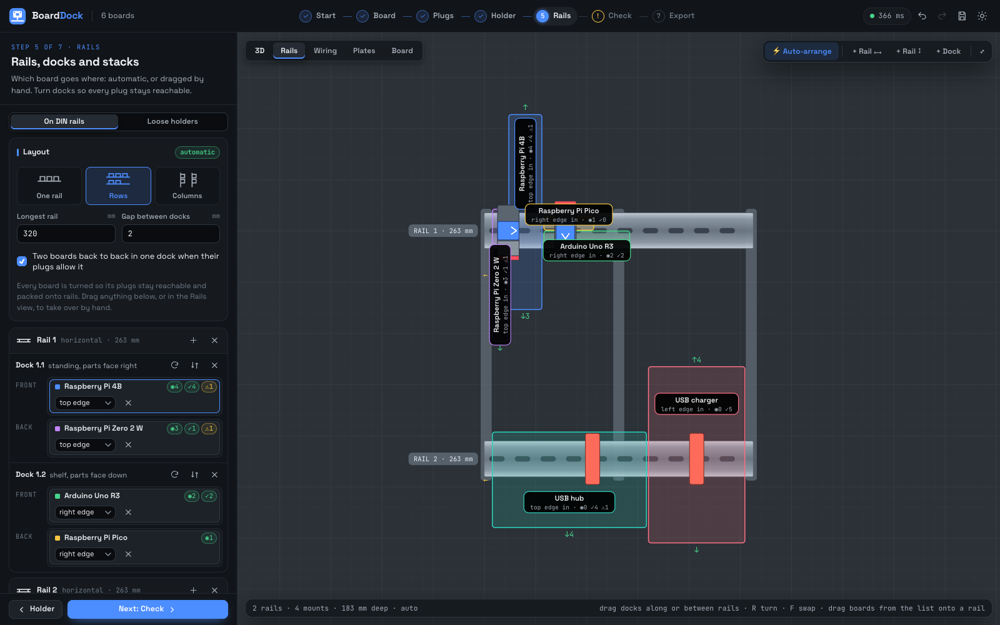

The **Rails** step shows the whole rack as a tree: rails, docks, the front and back slot of each dock, and stacked boards under the board they sit on. Chips show where the plugs point. Drag a board onto:
- a slot, to seat it there;
- a rail, for a new dock at its end;
- another board, to stack it;
- **+ Rail**, for a new rail with it;
- the tray, to take it off the rails.

Quick layouts are **one rail**, **rows** (a new rail when one gets longer than your limit) and **columns** (vertical rails).

The **Rails** view shows the rack from above: rails, table stands, docks, and every board's footprint. Arrows show where each board's plugs point:

| Mark | Meaning |
|---|---|
| **◉** | points up |
| **✓** | reachable from the side, where the cables run |
| **⚠** | points at the next dock on the rail |
| **✕** | points down into the table |

**Auto-arrange** (on by default):
- Tries every dock edge and all four turns for each board, and picks the one with the best plug access.
  - It never lets a plug point into the table.
  - It keeps the release button clear of plugs, and prefers boards that stick out less.
- Pairs boards back to back in one dock when that costs nothing in plug access.
- Packs the docks along the rail using their real 3D size, including plugs, cradles and buttons.
- Starts a new rail when one gets longer than your limit. Boxes such as hubs and chargers get a rail of their own.
- Keeps boards that are cabled together next to each other.
- Settings: rail direction, longest rail, gap between docks, space between rails, and pairing on or off.

Under **Boards in their docks**, a small table compares the choices you have tried on this rack: rails and their length, how far it stands out from the wall, and cable to buy. **Whichever suits each** says which boards it laid flat.

Auto-arrange also keeps each holder's tongue (the part that plugs into the dock) under the limit Check holds it to: a long board is docked by an edge that gives a shorter lever, and a board that can't stand on any edge without failing it lies flat instead (even with the rack set to stand boards up). Where a board still fails a check, the Rails tree shows it under the board, and for a tongue over its limit a button docks it by another edge (or lays it flat) when that fixes it. Changing how a board docks (that button, another edge, standing or lying flat) slides the docks after it along the rail to make room, since a board lying flat reaches further.

With Auto-arrange on, every change lays the rack out again, a new cable too. When a new cable adds a rail, moves a board to another rail or adds 30 cm or more of cable to buy, a toast says so and offers **Keep the old layout**.

On a built rack, **Auto-arrange** asks first, as it moves built boards.

**Editing by hand.** The first edit keeps everything where it is and switches to manual. A dock dropped on top of another slides to the nearest gap beside it, and a dock a board leaves empty goes. **Tidy up** takes out empty docks and slides overlapping docks apart along their rail, leaving everything else where it is.

| Action | How |
|---|---|
| Move a dock along its rail | drag it, or use the arrow keys (Shift = 10 mm) |
| Move a dock to another rail | drag it onto that rail |
| Move a rail | drag the rail |
| Turn a dock 90° | **R** (Shift+R turns the other way) |
| Swap front and back boards | **F** |
| Select several docks | Shift-click, or drag a box; ⌘A selects all |
| Remove | Delete |
| Put a board on the panel | drag it from the board list onto a rail (new dock) or onto a dock (shares it back to back) |

The inspector sets:
- dock or flat clip;
- which side of the rail the release lever is on;
- turn, with a picture of each turn;
- rail and position;
- the board in each slot;
- which board edge goes into the dock, or Auto;
- rail direction, position and length (fixed, or cut to fit).

**Overlaps** between neighbours are hatched red. The Check step lists the rails to cut and how tall the rack stands.

## Hubs, chargers and other boxes

A box is a size and rows of ports (Board step, **Box**). Pick a preset (USB hub, powered 7-port hub, USB-C hub with Ethernet, USB charger, USB charger with USB-C, network switch, plug-pack supplies) or set your own:
- length, width and height; its **corners** seen from above (square, rounded by a radius up to fully round ends, or cut off straight); its **colour** in the 3D view;
- any number of rows of ports, each on its own card: how many, which type (USB-A, USB-C, micro-USB, USB-B, DC barrel, mains, RJ45, HDMI, audio, screw terminals), on which face (front, back, either end or the top), and what they are for (hub port, upstream, power out, DC out, power in, and so on);
- for ports that give power, what each one gives (a 27 W USB-C PD port gives 5 A, most USB-C charger ports 3 A), and a DC port's voltage;
- a plug pack's own lead length, and a powerboard's rating (A, from its label).

**Plug packs** (Start › Hubs and chargers: the Raspberry Pi 27 W (5 A) and 15 W (3 A) USB-C supplies, a 12 V DC plug pack) plug straight into a powerboard's outlet, so they stay off the rails; their own lead goes to the board. Auto-connect plugs them in, and the shopping list says their lead comes with them and counts no strap for them (straps are only for boxes that get a holder on a rail, and a plug pack never gets one). A DC pack only goes to a DC input on its own when both say the same voltage: BoardDock can't check polarity, so check both labels.

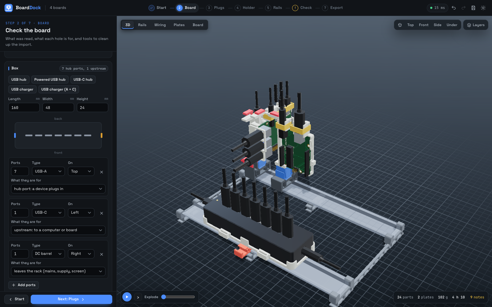

By default a row's ports are spaced evenly and centred on their face, as before. Under **Where they are** on each card you can make it match your box exactly:
- **Along the face:** centred with the other rows, measured **from the left or right end** (from the front or back on an end face: from the end of the box to the near side of the nearest port, what your calipers read), or **each port where you put it** (for a hub with uneven spacing: type each port's centre, or drag it in the editor). Switching between these never moves the ports; the new way starts from where they are.
- **Spacing:** from one port's centre to the next.
- **Height up the side:** where the middle of the ports is, from the bottom of the box (halfway up unless you set it).
- **Which way up:** flat, upside down, or on its side (upright) turned either way. The wording names what you can see in the socket: a USB-A's tongue, an RJ45's latch, a micro-USB's or HDMI's wide side. An upright USB-A takes its height along the face, and the holder's opening, the plug drawn in it, its cable and the box's own 3D picture all turn with it. Round sockets (DC barrel, audio) have nothing to turn.
- **On top:** across the middle, by the front or back edge, or so many mm from the front; and turned by any angle (0: along the box, 90: across it; 45 lets plug packs sit side by side).

A live sketch above the cards shows the box from above, each port with an arrow the way its plug goes in (a dot for one on top), and each side with ports as you see it standing in front of it, every socket drawn the way up it is. Hover a card to light its ports up. Every port knows its role, so Auto-connect never has to guess whether a USB-A socket on a box takes a device or gives power. Ports on the top get plugs standing in them, and the strap loops move to miss them. The editor says when ports don't fit their face, run past its end, overlap, or sit higher or lower than the box. Fewer ports keep the first ports' names, so cables to them stay; cables to ports you remove go. Older racks' boxes lay out exactly as they did.

### Build your own box

On Start, **Draw your own › A box** builds one from scratch: pick what it is (a USB hub, a USB charger, a power supply, a debug probe or a USB-serial adapter), its name, size and colour, with the sketch updating as you type. It starts with a typical port or two for its kind (a hub: four USB-A and a USB-C upstream); change them and add rows under **Box**, then drag each port in the editor to where it is on yours (a photo of it under the drawing helps). **Save to My boards** keeps it for any rack. None of the holders for these has been printed yet: check the fit of a test print against your box.

The Plugs step counts what still needs a port: USB devices against free hub and computer ports, and boards that need power against free ports strong enough for them. A board on a port too weak for it (or powered through the hub it hosts) counts as still needing power, so the offer to add a charger (or, for Pi 5s, their own 27 W supplies) stays until every board has enough; adding one connects it and moves the boards on weak ports onto it. A USB device with no port on the rack can go to **your computer** instead of a hub. A stacked pair of USB-A sockets, like on a Raspberry Pi, counts as two ports ("USB2 lower" and "USB2 upper"). Boards with screw terminals or jumper headers and nothing connected (a relay board, a power distribution board) are listed too: Auto-connect leaves wiring to you.

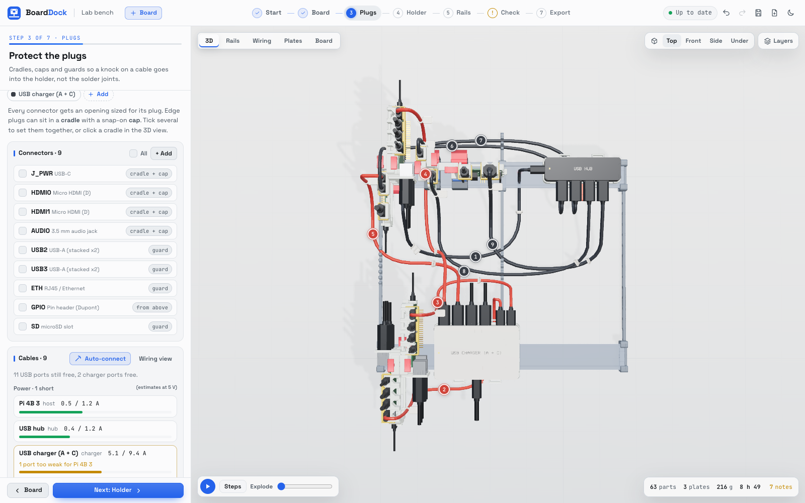

**Power budget.** Every charger, powered hub, bus-powered hub and Raspberry Pi USB port gets a bar: what the boards on it take at full load against what it gives, at 5 V. It warns when a charger is asked for more than it gives, when a Pi's four USB ports (1.2 A between them) or a hub with no supply of its own carry too much, and when a board needs more than its port gives (a Pi 4 wants a 3 A supply; a USB-A charger port gives about 2.4 A). A Pi 5 wants 5 A, which only a 5 A USB-C PD supply gives (a USB-A to C cable never can): on a 3 A port it runs, but holds its USB ports to 0.6 A between them, and the budget says so. **Move boards to stronger ports** takes boards off ports too weak for them and onto stronger free ones, in one undo step. Under the sources, each powerboard gets a **mains** bar: what the supplies plugged into it draw from the wall at full load (an estimate, at about 85% efficiency) against its rating (typical figures: AU 10 A, UK 13 A, US 15 A, EU 16 A; set yours under **Box**). The figures are estimates: the makers' recommended supplies and typical draws under load. Set a board's own under **Board › Power** and a charger's total (the watts on its label, divided by 5) under **Box**. Check lists the same.

### Powerboards

Powerboards (power strips) are boxes too, under Start's accessories: 4 or 6 outlets, with a switch by each, with outlets turned 45° so plug packs fit side by side, or with two USB ports. Set the outlets (AU/NZ, UK, US or EU), how many, their angle and the size under **Box**; the outlets spread evenly along the top. Auto-connect plugs each charger's mains lead into a free outlet, and buys the lead only if it is longer than the one most chargers come with. The shopping list names hook-up wire by size (red and black, 0.5 to 0.75 mm², ferrules for screw terminals) and a barrel-to-wire lead as a pigtail. A powerboard's own lead goes to the wall: BoardDock never plugs one powerboard into another, refuses to in the Wiring view and **Cable to**, and fails Check if an older rack has one. It won't put a mains outlet onto screw terminals either: mains through relays belongs in a proper enclosure, wired by someone qualified to. BoardDock checks which plug goes into which outlet and adds up the load it knows about; it can't check your powerboard, its lead, earth or the wall socket.

A box longer than your printer's bed (a powerboard usually is) gets its holder in two halves that meet end to end, each clipped to the rail on its own.

## Table stands

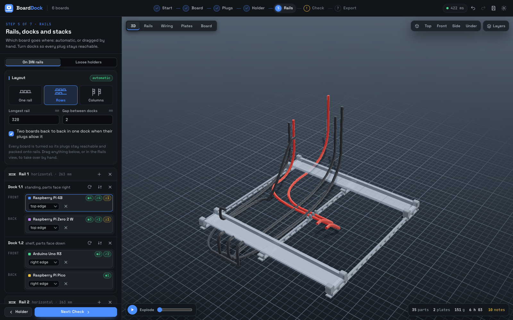

The rails stand on printed sleepers (Rails step, **Table stands**, on by default):
- A sleeper crosses the rails at each end, and at least every 200 mm between.
- Each **rail end pushes 7 mm into an end block** with a TS35-shaped pocket. It caps the rail's lips, and crush ribs make it a light press fit.
- **Saddles** carry the rails in between. Their low cheeks stay under the dock shoes' jaws, so a saddle can sit under a dock.
- **Spacer bars** join the blocks. They slide in along the rail through dovetails, and set the rail spacing.
- The rails stand 10 mm off the table, so cables can run under them.

The pieces scale with the rack: more rails give more blocks and spacers, and longer rails give more sleepers. In the automatic layout every rail is cut to the same length, so the sleepers run straight across. Every piece is a profile printed on its end: no supports, and every load lies in the plane of the layers.

| Piece | Plastic |
|---|---|
| End block | 3.6 cm³ |
| Saddle | 2.2 cm³ |
| Spacer, 150 mm | 2.5 cm³ |

The Check step also reports two hand calculations:
- the rail's sag between sleepers under a 20 N press, treating the rail as a steel beam;
- the stress in an end block's lip caps when you lift a rail end with 20 N: about 6 MPa, against PETG's yield of about 50 MPa.

A lone rail gets short feet on each end block, so it stands on a wider footprint. **Tipping**: when the holders and boards reach more than 1.5 times as high above the table as the stands are wide at their narrowest, Check says so. That's a rule of thumb, not a calculation: a lone Pi on a short rail gets a note to hold the rack while plugging in; a big board standing on a short rail gets a warning, with ways to steady it (lay it flat, add a rail, space the rails wider).

## Cables

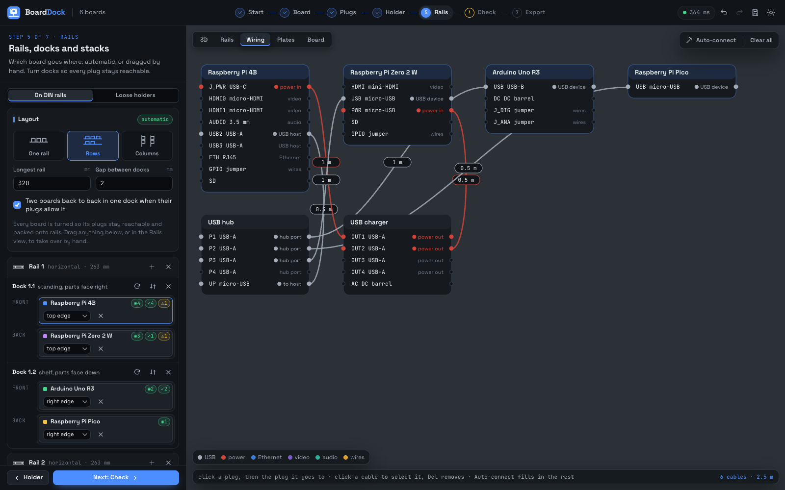

Each plug gets a role from its type, its name and its board:
- a Raspberry Pi's USB-A ports are hosts, and its USB-C is its power input;
- an Arduino's USB-B is a device, and its barrel jack is an optional 7–12 V input;
- a hub's ports feed devices;
- a charger's ports give power.

**Auto-connect** pairs the free plugs the way you would lay them out yourself, and says why it chose each one (hover a cable):
1. hubs to the nearest computer or board that hosts them (a hub with Ethernet or USB 3 ports on a USB 3 port where there is one); with nothing on the rack to host it, to **your computer**;
2. power: every board that takes power over USB, only from a port that gives it enough (a Pi 5 on a 5 A supply where there is one, a Pi 4 on a USB-C port), with no charger loaded past what it gives and the load spread over the chargers. A board no free port can power is left free, and the Plugs step offers a charger or supply. With no charger port left, a powered hub's port will do for a small board, never a Pi, and never the hub that hangs off that same board;
3. devices (an Arduino's USB, a probe's or an adapter's USB) to the nearest hub port, else a board's own USB port while their shared limit allows (a Pi 4's give 1.2 A between them), else **your computer** (off the rack; its 2 m cable is on the shopping list);
4. each board's Ethernet to a **network switch** in the rack (Start › Hubs and chargers has 5- and 8-port ones);
5. a DC plug pack's lead to a DC input of the same voltage;
6. mains leads and plug packs to the nearest free outlet of a powerboard (never one powerboard into another);
7. J-Links and serial adapters to the headers they serve.

Each kind is paired all at once (the cheapest pairing in all, not first come, first served), by how long each cable would be on the rack as it is laid out. **Rewire** chooses Auto-connect's cables again after you move boards, and leaves the ones you connected yourself.

In the **Wiring** view:
- **Drag** from a plug to the plug it goes to, or just onto the board (it takes that board's best free plug that fits). Plugs that fit light up green as you drag.
- **Click** a plug for its **best matches**: the free plugs it fits, best first, each with how long the cable would be and what the port gives. Or click the plug it goes to.
- **Drag a plug that already has a cable** to move that end of the cable to another plug (it keeps its number).
- After you connect one by hand, **Connect N more like this** does the same for the other boards like it.
- The **List** panel's **To do** says what still needs a cable (a board without power, a device without a port, a header without a probe) with the best match and a **Connect** button for each. It also says what the rack is short of: not enough charger ports, hub ports, or no switch. **Add a USB charger** (or a hub, or a switch) puts one in and connects it. **Cables** lists every cable with its number, its two ends, what it is and its length.
- Pin headers open into their pins, and a pin then a pin adds a jumper wire.

In the Plugs step, pick **Cable to** for any plug.

The panel routes every cable:
1. Out of its plug and clear of its own board. A plug pointing up out of a board standing on edge steps sideways off the board before going down; a plug pointing sideways drops, reaches further out first, or slopes straight into a lane it faces. A drop that would land on a sleeper steps along the rail first.
2. Down to a **street** between the rails (or beside the outer ones), where each cable gets its own lane. Lanes are ordered so as few cables cross as possible.
3. Along the street and back up to the other plug the same way.
4. Then all the cables **settle together**, the way real ones do once they are plugged in. Each is a chain of beads:
   - where two cross, one lies over the other; where they run together, they lie side by side;
   - nothing goes through a holder, dock, plug or ribbon;
   - each cable keeps its length (it can't stretch), with a few per cent of slack in its free stretch (a cable lies, it isn't pulled taut);
   - it has weight: a free span sags, never below the streets, and it lies in the stands' combs where its street crosses them;
   - it has stiffness, more the thicker it is: it runs straight out of each plug for about a bend's length, keeps that stretch close to how it was laid, and bends nowhere tighter than about three of its own diameters;
   - pushed out of anything, it goes back out on the side it was laid, so it never pops through a board to the far side;
   - two cables laid on top of each other (out of neighbouring plugs the same way) are eased apart side by side first;
   - last, the ripples are smoothed out wherever that touches nothing.

   Ribbons stay where they were laid and the rest settle round them. Check says how many places the planned routes met, warns about any pair still pressing on each other, and names any cable still squeezed into a tighter bend than a cable likes (it happens between plugs very close together).

Every combination of these is checked against the bounding boxes of every holder, board, plug, dock, rail and stand piece, and the shortest route that hits nothing wins. If every route touches something, the cable is marked in red in the 3D view and the Check step says what it runs into.

On table stands the streets run under the rails' level. Wherever a street crosses a sleeper, the spacer there carries a **cable comb**: one round-bottomed slot per cable, sized for it, with snap lips at the mouth.

Every cable's length is measured along its route and rounded up to a standard length to buy (10% slack). Auto-arrange keeps cabled boards next to each other and puts each hub or charger in the middle of the boards it feeds, on the same rail when it fits, so the farthest cable is short too (on a rack of six Pis and two chargers that took the longest cable from 66 to 51 cm, and the cable to buy from 4.3 to 3.5 m).

The Wiring view is a canvas: pinch (or ⌘ + scroll) zooms where the pointer is, scrolling or dragging the background pans, and the percentage button fits everything in. Drag a card by its title to move it; it stays where you put it. Cards also stay put while you connect cables (they used to shuffle as the rack re-laid itself, so the next click could land on the wrong plug); **Arrange…** lays them out again. **Arrange…** lays every card out again, either as the cables flow (chargers and hosts on the left, then hubs, then probes and adapters, then the boards they serve, each column ordered so cables cross least) or as the boards stand on the rails. Hover a card, a plug or a pin for details. Type in **Find a board**, or click a board's title, to show just its cables and the boards at their other ends; Find a board also zooms to fit them. Cable numbers and lengths sit on top of the cards.

A pin header (▸) opens into its pins, with their net names from your KiCad file. Click a pin, then a pin on another header, to add a jumper wire (a ground pin gets a black wire, a supply pin a red one). Each wire is labelled with its two pins (TXD→RX), and a white or yellow one gets a dark edge so it shows on the light theme. Click a wire and press Delete to take just that one off.

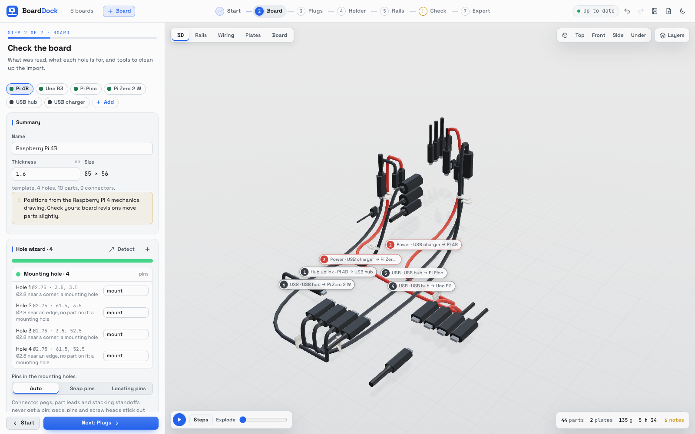

**Every cable has a number**, and it keeps it: adding or removing other cables never renumbers it. The number and what the cable is for ("Power: USB charger → Pi 4B", "Hub uplink: Pi 4B → USB hub", "USB: USB hub → Uno R3") show:
- on a badge on the cable in the 3D view (on a busy rack just the number; hover for the rest; **Layers › Cable numbers** hides them);
- in the Wiring view, next to the length to buy;
- in the Plugs step's cable list, the shopping list and the assembly steps.

**Numbered cable tags** print with the rack, two per cable: a C-ring that snaps round the cable (sized for it) with a flag carrying the number, raised so a second colour or a marker picks it out. In 3D they sit a hand-width from each plug, where they go. Switch them off in the Plugs step.

## The 3D view

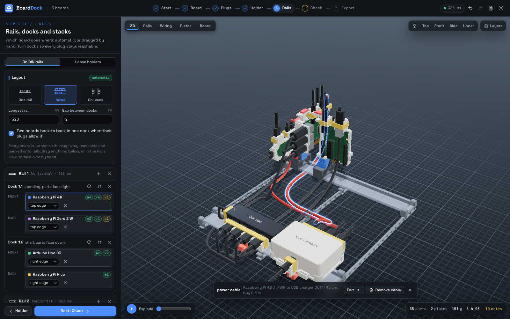

| Action | How |
|---|---|
| See what something is | hover over it |
| Select a board, dock, rail, cable, table stand, or one holder feature (cradle, cap, pin, spring clip, guard, tie anchor, label, stand socket) | click it |
| Select several | Shift-click |
| Remove the selection (a cradle or cap is switched off, a pin becomes an ignored hole, a dock, rail or cable is removed, a board leaves the project, table stands are switched off) | Delete, or **Remove** in the bar below the view; one ⌘Z brings it all back |
| Jump to the settings of the selected thing | **Edit** in the bar |
| Change how a board is mounted, right there | pick the board (or its dock): on a rack, **Stands up** or **Lies flat**, which edge goes in the dock (or carries the tab), turn the dock, swap its front and back boards; with loose holders, the DIN clip on or off, flat on the rail, across it or along it, and which way its release tab points |
| Fly to a part | double-click it |
| Watch it go together | the play button. It goes step by step, the way you would build it, with an instruction for each step: saddles on the table, rails in, end blocks on, spacers in, shoes clipped on, sockets in; then for each board, its release rod into the spine, the board into its holder, anything stacked on it, and the holder into its dock; then the cables (power first, mains last), the caps, and a last step: check every screw terminal, switch the powerboards off, plug them into the wall, then switch on. **‹ ›** step back and forward; **✕** shows it assembled. |
| Pull it apart | the **Explode** slider |
| Show or hide holders, docks, caps, boards, plugs, cables, cable numbers or rails | **Layers** |
| See every keyboard shortcut (the board editor's V, H, M, T and arrows too) | **?** |
| Go to a step | **1** to **7** |

Plugs are drawn after their type: a USB-C's slim oval overmould, a USB-A's metal shell and grip ridges (a stacked pair takes one plug per socket), an HDMI's flat shell, an RJ45's clear plug and boot, a barrel plug's sleeve, a 3.5 mm plug's rings, wires with ferrules in a screw terminal. A port shows a plug only where a cable goes: a cable to another board on the rack, a cradle the board has for one (a screen or a supply off the rack), or a box's own supply (mains, DC in); a free port stays empty. A lead that leaves the rack (to a screen, a supply, the wall) is drawn as a short stretch out of its plug that fades away, then a dotted line on the way it goes and where to ("to a screen", "to the wall", "to its power supply"); nothing hangs about in the air. Running your Pis headless, **Go headless** in the Plugs step drops their HDMI and audio cradles (and their caps) on every board. A cable's number badge reads what it is and where it goes ("Power → Pi 5"); hover it for the whole label. Cables in the rack bend in arcs of about four diameters, as real ones do.

**Live** (in the bar under the view, on by default) switches the rack on: every LED glows in its colour and does what it does (a power LED stays on, a Pi's ACT flickers or beats, an Arduino's L blinks once a second, a network jack's link light is on and its activity light flickers while a cable is in it, a relay board clicks through its relays, an RGB pixel runs through the rainbow), a board with no power cable stays dark, and pulses run along the cables the way power or data goes. Boards read in from files light their own LED parts (colour and job from their names: PWR, ACT, TX, a colour in the part name); template boards light the LEDs the real board has, drawn in (they are not parts, and nothing is printed round them). Only for the look: whether each board gets enough power is the Power check's job. It redraws a few times a second at most, and holds still if your system asks for reduced motion.

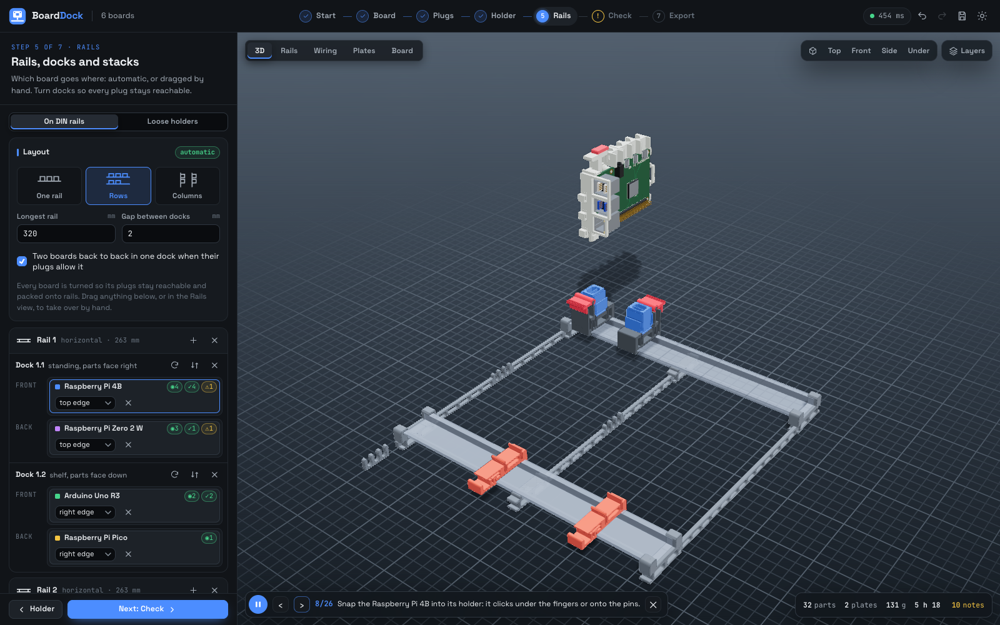

It uses studio lighting with ambient occlusion. Boards get:
- a solder mask with copper traces and vias: the real ones from KiCad files, and a decorative pattern, only for looks, on every other board;
- silkscreen;
- gold pads and pins;
- chips with their part numbers, passives with tinned ends, LEDs with their lenses, tactile switches, crystals;
- a slotted metal DIN rail, and printed parts with the fine lines of their layers (they fade out when too small to see).

Plugs show their shells, tongues and pins. The view draws a frame only when something changes.


**Steps** plays the assembly the way you would do it, each part moving the way it goes in: a rail shoe is hooked under the rail and swung down; a socket is pressed into its shoe; a board is tipped in under the spring clips on its far side and pressed down on this one; a probe or adapter slides down its slot; a holder is pushed into its dock; snap-fits go a little past their seat and spring back (the click); plugs go in quickly, then their last few millimetres slowly; cables are drawn along their route as they are plugged in, and their numbers appear with them.
## A new version of a board

When a new revision of one of your boards comes out, select it (in 3D, or its chip in the Board step) and press **New version…**, or drop its files on that button. The new version takes the old one's place:
- it keeps its name, dock, stack, holder settings and every cable to a plug it still has;
- the choices made on the old one carry over where the part is still there: plug cradles, caps, guards and tie anchors, hidden parts, and holes set by hand;
- what changed is listed (the Board step keeps the list): "Connectors: J2 moved 2 mm; J4 new (USB-C)", "Holes: 1 moved (up to 0.8 mm)", "Tallest part underneath: 2 → 3.5 mm", or "No mechanical changes: the holder comes out the same".

If the new version makes something fail in Check that did not before (a bigger holder now overlapping its neighbour, say), the toast and the board's list of changes say so.

To put a **different** board in a board's place (an Arduino Mega for an Uno), press **Replace with…** on its card in the Board step and pick one from the library, or drop its files. It keeps the old one's dock, stack, holder settings and the cables to plugs it also has; What's new calls it a swap.

**Print its holder** goes straight to Export with just that board (its dock on the rack stays, so it is left out); on a rack marked as built, **What's new** lists exactly its new parts, and the old holder is listed as spare. Slice it there for the G-code. One ⌘Z goes back to the old version.

## J-Links and serial cables

A board's debug headers are found on import:
- by shape: a 2 × 5 header at 1.27 mm (the Cortex debug connector, whatever its footprint is called), Tag-Connect pads;
- by name: a 10 or 20-pin header whose reference, value or footprint says SWD, JTAG or debug.

UART headers are found by name (UART, serial, console, FTDI, TX/RX). To mark any other part, select it and choose **Debug / UART…**. A board you measure by hand can be given debug and UART headers when you create it.

The Board step lists them under **Debug & UART headers**:
- **+ J-Link** on a header's row puts one J-Link on just that header; **Add 2 J-Links** puts one on each free debug header. Each is cabled to its header and named after it ("J-Link (Dual-MCU controller J_SWD1)", shown as "J-Link → J_SWD1" in the rack). A header with a J-Link shows its ribbon length, which you can set right there, and how long it needs to be when it is too short.
  - A J-Link (about 50 × 50 × 3 mm, its 10-pin ribbon socket, a shrouded box header with its key slot, on the top face by one edge and its micro-USB on the edge opposite, its MCU, crystal, regulator and power and activity LEDs drawn on it: set yours under Box) slides down into a slot in the back of its board's dock, USB end up, under a lip along each side.
  - A second J-Link for the same board gets the next slot, pressed onto corner towers.
  - Each ribbon leaves its socket flat, lies up along the J-Link, loops over the top of the dock and comes down the board to its header; a second one loops over the first. It is drawn grey with a red pin-1 edge, checked against the ribbon's length (200 mm unless you set yours) and never on the shopping list. An adapter is listed where the pin counts differ.
  - **Auto-connect** plugs the J-Links' USB into a hub, and pairs any loose J-Link with a free debug header.
- **Add a USB-serial adapter** puts a USB to TTL adapter board (the red FT232RL one: mini-USB at one end, six right-angle pins at the other with GND, CTS, VCC, TXD, RXD and DTR printed beside them, the FT232RL chip, TX and RX LEDs, the 3.3/5 V jumper; set yours under Box) in the slot behind the board, on top of its J-Links. Female–female jumper wires go from its pins to the UART header, crossed over: GND to GND, its TXD to the board's RX, its RXD to the board's TX. They are drawn one by one, a housing on each pin, bundled round the dock, and bought by the wire (10, 15, 20 or 30 cm). Its USB goes to a hub with Auto-connect.
- **or a serial cable** runs a USB to TTL serial cable (3.3 V, the kind with loose jumper ends) from the nearest free hub port, or a computer's, to each free UART header. Its black end goes on GND, green (its TX) on the board's RX, white (its RX) on the board's TX, and red (power) stays off. The pins come from the nets in a KiCad file (GND, RX, TX); otherwise they are a guess from the header's size, which you can change under the header. It is routed, numbered and bought like any cable, and never counted as powering the board.

On a rack laid out by hand or already built, a new J-Link or adapter goes into the free slot of its board's dock (else the nearest free slot on that rail, else a new dock at the end), and the toast says which, and how much longer the rail got. A J-Link added from the library goes the same way as soon as it is cabled to a board's header. Auto-arrange puts each board's probes in its dock's back slot, and any more right beside it, so ribbons and jumper wires reach; Check warns about jumper wires longer than 30 cm. Export lists just its own slot holder and what comes with it, nothing you have printed changes, and it slides along the dock only as far as the board's holder reaches, so the rail stays as it is.

The examples to try it on are under **Start › Example: dual-MCU board…** and **Example: sensor board…**, and as KiCad files in `examples/`. None of this has been printed yet.

## Coming back to add a board

Once the rack is built, press **Mark the rack as built** in Export. BoardDock remembers what you printed, the rail lengths you cut and the cables you bought, and freezes the layout: every dock keeps its place, turn, lever side and board edges.

Later, open BoardDock. A saved rack opens on **Your rack**, with its boards, whether it is built, and buttons for the rails, the cables and what's new to print. Drop the new board's files in. It goes:
1. into the empty slot of a dock already on the rack, if it fits there with all its plugs reachable and without touching anything (then only its holder is new);
2. otherwise into the first gap on the rails that is clear in 3D, preferably on the rail of a board it is cabled to;
3. otherwise on the end of a rail, and Export tells you that rail has to be longer.

Nothing else moves; where a board in a free slot makes its dock reach further, the docks beside it slide along the rail just enough to clear it, and the toast says where the board went. Connect its cables (Auto-connect only fills plugs that are still free). Export then lists what to do since the build:

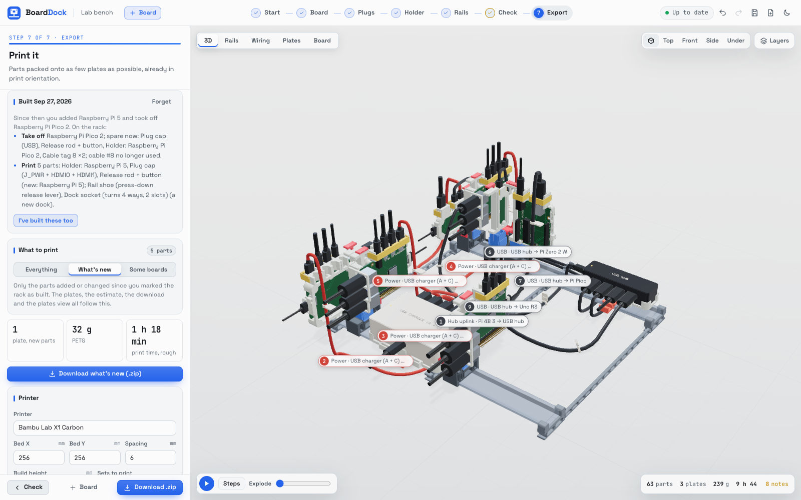

It is a numbered checklist in the order you would work at the rack, each step with the parts to print for it; tick steps off as you go:
- **Take off** the boards you removed, from their dock ("dock 1.3 front");
- **Swap** a board for its new version, or for the board that took its place, in the same dock;
- **Cut** any rail that has to be longer, and **move the end block** out to the new end;
- **Move** boards that now sit somewhere else ("Arduino Uno R3 from dock 1.3 front to dock 1.2 front"; docks are numbered by rail and place);
- **Clip on** each new dock, at its distance in mm from the rail's start;
- **Seat** each new board in its holder and plug it into its dock (or onto the board it stacks on);
- **Plug in** the new cables, and say when a cable you have is now too short ("#4 is now 1 m, yours is 0.5 m");
- what is **spare** now: parts and cables (by number) the rack no longer uses.

Plates, the estimate and the download (with the same list in its README) follow it. Press **I've built these too** when you have.

## Supported files

| Source | What to export | What BoardDock reads |
|---|---|---|
| **KiCad** 6–9 | the `.kicad_pcb` file | outline (lines and arcs), holes, footprints with courtyard sizes, top and bottom parts, copper traces and vias |
| **Altium Designer** | *File → Export → STEP 3D*, or Gerber + NC drill + pick-and-place | STEP: board outline, holes and part bodies. Fab files: outline, holes, parts. |
| **Fusion 360 / Eagle** 6 and later | the `.brd` file, or STEP | outline, holes, packages |
| **Old Eagle** (3 to 5, binary) | the `.brd` file as it is: no Eagle needed | outline (lines, arcs and circles), cut-outs, holes, parts with their sizes and sides, pin header pins, copper tracks and vias |
| **Board viewers** (the files OpenBoardView opens) | the `.brd`, `.bdv`, `.bv` or `.bvr` file | outline, each part as the spread of its pins, top or bottom, pin nets. No holes or heights. |
| **EasyEDA / JLCPCB** | Gerber zip + CPL (pick and place) | outline, holes, parts |
| **Any EDA tool** | IDF 3.0 (`.emn` + `.emp`) | outline, cut-outs, holes, part outlines and heights |
| **Allegro, OrCAD, PADS, Xpedition, Altium, Zuken and others** | IPC-2581 (`.xml` or `.cvg`) | outline and cut-outs, board thickness, holes (plated or not; vias left out), parts with their place, side, turn, package size and height, header pins with their nets |
| | ODB++ (a `.tgz` or `.zip`, or the job folder dropped as it is) | outline and cut-outs, holes from the drill layers, parts from the top and bottom component layers with package sizes from `eda/data`, header pins with their nets; inch or mm |
| | GenCAD 1.4 (`.cad`) | outline and cut-outs, board thickness, mounting holes (mounting-hole parts and `$MECH`), parts from their shapes, heights, header pins with their nets |
| **Mechanical drawing** | DXF | outline and round holes |
| **No files** | draw it, or start from a template (Raspberry Pi 4 / Zero / Pico, Arduino Uno / Nano, perfboard) | |

Connectors are recognised by footprint name: USB-C, micro and mini USB, USB-A and B, HDMI, RJ45, barrel jacks, 3.5 mm audio, microSD, SMA, Qwiic, terminal blocks, JST and pin headers. Each one gets a plug size you can change.

A `.brd` can be many things, so BoardDock looks inside to tell them apart: an Eagle XML board, an old binary Eagle board, or a board-viewer file (Test_Link `.brd`, BRD2, `.bdv`, BVR). A zip holding one works too.

- **Old binary Eagle boards** (Eagle 5 and older) are read directly, so you don't need Eagle, which Autodesk no longer sells. Their format was never published: BoardDock follows the layout worked out by the open-source readers pyeagle and pcb-rnd, and says so on the board. Check the outline, holes and parts against your board before you print.
- **Board-viewer files** are the repair-shop kind: they hold part names and pin positions but no package names, holes or heights. A part's size is the spread of its pins, and connectors are found by their names (J1, USB1, CN2), so check each connector's type and add the mounting holes yourself.
- **Cadence Allegro** `.brd` files: in the desktop app, through your own KiCad 10 (see below).

Altium `.PcbDoc` files use a proprietary binary format. Export STEP or fabrication files instead; BoardDock explains this if you drop one in.

**Cadence Allegro / OrCAD PCB Editor `.brd` files** are binary and their format is not published. KiCad 10 reads them (releases 16 to 23) with a reader its developers reverse-engineered from hundreds of real boards; BoardDock uses that rather than guess at a format it has no boards to check against (a wrong outline or hole and the holder would not fit). **In the desktop app, with KiCad 10 or newer installed (free, kicad.org), drop the `.brd`, on its own or in a zip, and it comes straight in**: BoardDock runs KiCad's `kicad-cli pcb import` on it and reads the KiCad board that makes. It finds KiCad where it installs (on a Mac `/Applications/KiCad`, on Windows `Program Files\KiCad\<version>`, on Linux `/usr/bin`) or on your PATH. In the web app, or without KiCad, it recognises the board and says how to get a file it reads: KiCad's *File → Import → Non-KiCad Board File*, then drop the saved `.kicad_pcb`; or IPC-2581, ODB++, GenCAD, IDF, STEP or Gerbers with drill and pick-and-place from the designer or board maker. Tested with a stand-in for `kicad-cli`, not yet with a real Allegro board.

**Zips, tgz and folders.** Archives can hold folders, and archives inside archives (a zip with the ODB++ `.tgz` in it). When one archive or folder holds the same board in several formats, BoardDock reads the one that tells it most, in this order: KiCad, STEP, IPC-2581, ODB++, IDF, Eagle, binary `.brd`, GenCAD, Gerber + drill + pick-and-place, DXF. If that file cannot be read it tries the next, and the board's notes say which file was used, which ones failed and why, and which were not needed. An archive with several board files of the same kind (three `.kicad_pcb` files) still comes in as several boards.

## Loose holders

Choose **Loose holders** in the Panel step for holders without a rail dock:
- **stacked** on corner towers with press-fit pegs;
- **side by side** with printed link bars;
- **back to back** with snap rivets.

Each holder can also have a flat pull-tab DIN clip or a **stand socket** (round, square, hex or D-shaped post, or a 1/4"-20 tripod nut trap). Loose holders start without the DIN clip (tick **DIN rail clip** if you have a rail), and the shopping list and assembly notes only mention a rail when there is one.

- A stack never covers a box: hubs, chargers and powerboards stand beside it on the table, so their ports and outlets stay free.
- A board bolted onto another (a HAT on a Pi, a shield on an Arduino) gets a standoff on each hole the two share and a screw in each end, sized from those holes (M2.5 for a Pi, M3 for an Arduino); the Rails step says how many next to the board.
- Cables between loose holders aren't routed or sized (there are no rails to run them along): each plug gets a short cut-off tail in 3D, Check says so, and the shopping list asks you to measure them on your bench. A box's own supply lead still runs off along the table.

| Stacked | Side by side |
|---|---|
| 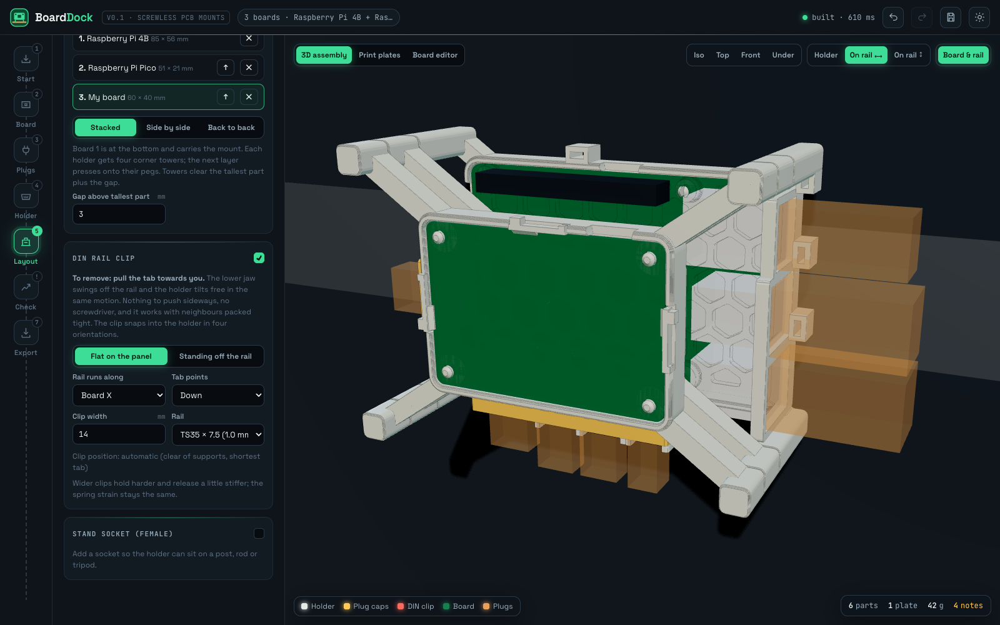 | 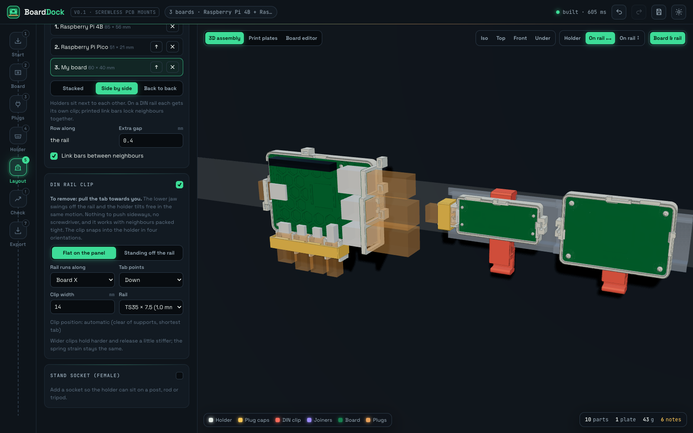 |

## Checks and FEA

### Printability, layer by layer

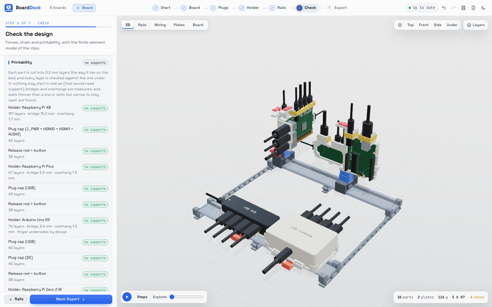

The Check step slices every distinct part into 0.2 mm layers in the pose it prints in and compares each layer with the one under it, the way a slicer sees it (in a background worker, once per part shape). Measured from each part's own bottom:
- **In mid-air:** anything with nothing under it would need support: the part says **needs support**. A fleck thinner than one line (or a single layer under 0.5 mm²) is only a *speck*, which slicers leave out, and is noted, not failed.
- **Overhangs and bridges:** how far each layer reaches past the one below, measured *inside the layer* from the wall that holds it (round a slot, never straight across air, and with no upper cap) and given as the real opening. Held from opposite sides it is a bridge; held from one side, an overhang. Overhangs: fine to 2 mm, a warning to 3 mm (or to 2 mm over more than 20 mm²), then **needs support**. Bridges: fine to 12 mm, a warning to 25 mm, then failed.
- **Sloped roofs:** a roof flatter than 45° steps out only a little each layer, so it is followed layer after layer: a warning once it runs out more than 3 mm, a failure past 10 mm.
- **A tiny foot:** a part taller than 5 mm whose first layer is under a tenth of its biggest one is failed (it would be knocked over).

Across the library (every template standing, lying flat, loose, in a tray and on a DIN clip, plus stacks, side-by-side and back-to-back pairs, the rack parts and the test-fit kit: 209 distinct parts) nothing is in mid-air, the longest one-sided overhang is 1.6 mm, and the longest bridge is 9 mm, except one: a holder on a DIN clip standing off its edge (rack or inline) has two slots across its plate whose tops are 14.4 mm bridges (a warning; see Honest limits). The test suite checks a mixed rack, racks lying flat and back to back, and each fix below.

What the audit of the earlier parts found, and what changed:
- The wall snap fingers were 8 to 14 mm one-sided overhangs over a slot (hidden from the check as "by design"): replaced by the spring clips above (a 0.9 mm ledge).
- Guard collars round a plug opening had flat roofs as wide as the opening (22.2 mm over a full-size HDMI, 17.2 mm over USB-A, 15 to 16 mm over a Pi 4's USB and Ethernet): they now have a 45° gable, so no flat roof is over 6 mm (the longest bridge on a Pi 4 with its cradles off is now 5.9 mm).
- Square and hex stand sockets on their side had a 10.3 mm flat roof and 30° roof faces: both now have a 45° gable.
- A tray's wall over a wide part hanging past the board's edge underneath was a 14.8 mm bridge: the window now goes up through the top of the wall.
- The probe and adapter slots' lips were 1.9 mm flat ledges: now 0.8 mm flat, then 45°.
- Snap rivets printed 1.3 mm below the bed, which dropped a whole back-to-back plate: they rest on it, and every plate puts each part on the bed whatever pose it comes in.
- A thin sill left in a frame's wall under an overhanging plug, and a one-layer fleck by the fingers, are gone.
- **Thin walls:** anything under 0.4 mm wide. A slicer without thin-wall detection leaves those out; in BoardDock parts they are only details of the engraved label and the button's chevrons.
- **Narrow slots:** gaps under 0.3 mm print closed. That matters only where something moves: the rail shoe's lever (0.35 mm round its pin) and the socket's latch nose, which now has 0.45 mm round it in its window (it had 0.2 mm, which could have welded it to the socket wall).


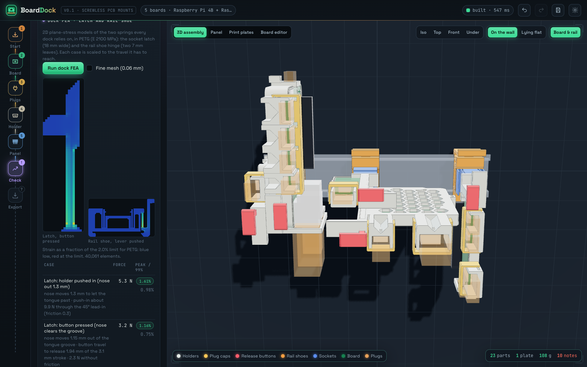

The FEA is 2D plane stress:
- **Elements:** incompatible-mode quads, validated against beam theory in the test suite.
- **Mesh:** square pixels, 0.1 mm (or 0.06 mm with the fine option).
- **Scaling:** each case is solved for a unit load and scaled to the travel it has to reach.

PETG results (E = 2100 MPa, strain limit 2%):

| Case | Force | Peak strain | 99% of the part below |
|---|---|---|---|
| Latch: holder pushed in (nose moves out 1.3 mm) | about 9 N push | 1.6% | 1.0% |
| Latch: button pressed (nose clears the groove after 1.9 of 3.1 mm) | 3.2 N | 1.2% | 0.8% |
| Rail shoe: lever pad pressed down (jaw opens 1.7 mm for about 8 mm of pad travel; the stop engages at 2.2 mm of jaw travel) | 1.4 N | 1.6% | 0.55% |
| Rail shoe: pressed onto the rail | 4.3 N | 1.7–1.9% | 0.5% |
| Rail shoe: pulled straight up off the rail | holds to about 90–120 N (the hinge's strain limit), friction or not | 1.7–2.3% at 100 N | 0.4% |

**Design changes that came out of this analysis**, compared with the original DIN hub:
- **Pull-off.** The original jaw hung from a hinge outboard of its lip. Pulling the dock off the rail pried the jaw open, and in the model only friction held it: without friction it let go at about 14 N. The v3 "C-jaw" wraps round the flange edge with the hinge leaf directly above the lip, so a pull runs straight down the leaf. It no longer depends on friction; the jaw moves about 0.03 mm per 100 N. The shoe is also 5% lighter.
- **Hinge leaf.** The lever pushes from above the hinge, so its bending peaks at the leaf's lower end. A uniform 0.9 mm leaf (two 0.45 mm lines) replaces the old 0.84–1.14 mm taper.
- **Pinch ear (v4).** The short thumb pad sat 14 mm below the socket top and was hard to reach. The lever post now rises into a tall ridged ear whose top is 3 mm under the socket top. With the holders out, you pinch the ear and the socket together with one hand. The longer lever roughly halves the force. The ear's top lip also lets you pull it: the lip is 8 mm outboard of the hinge leaf, so a pull turns the jaw open before it can lift the dock. The shoe grows 8% (7.8 to 8.5 cm³).
- **Press-down lever (v5).** Pinching the ear worked, but it looked clumsy and needed two opposing fingers. The ear is gone. Instead, a lever is printed in place on a pin at the top of a slim tower beside the socket, inside a C-shaped hub that wraps 290° so it can't come off. Pressing its ridged pad down about 8 mm makes the hook underneath pull the jaw's post toward the socket, and the jaw swings open about its leaf. The existing stop still limits the travel, and the jaw spring lifts the lever back. The release force is about 1.4 N. The shoe is 10.0 cm³.

## Printing

- **Material: PETG.** Every dock part is a spring. PLA is stiffer and more brittle, so strains that are fine in PETG are marginal in PLA. The Check step judges each part against your material's limit.
- **Printer:** pick yours in Export. The list has 18 printers: Bambu Lab X1 Carbon, P1S, A1 and A1 mini; Prusa CORE One, MK4S, MK3S+, MINI+ and XL; Creality K1C, Ender-3 V3 SE and Ender-3 S1; Voron 2.4 and Trident; Elegoo Neptune 4 Pro; Anycubic Kobra 3; Sovol SV06; and Qidi Q1 Pro. Bed size and build height come from the machine profiles in [OrcaSlicer's open profile library](https://github.com/OrcaSlicer/OrcaSlicer/tree/main/resources/profiles). Parts are packed onto that bed, and any part taller than the build height is flagged.
- **Print settings:** Export lists what to set in your slicer for your printer and material. Each setting shows where to find it in OrcaSlicer, Bambu Studio or PrusaSlicer, and is marked by where it comes from:
  - **design:** the parts need it. For example, 0.45 mm wall lines (the rail shoe hinge is exactly two of them), 0.2 mm layers, no supports.
  - **profile:** OrcaSlicer's generic filament profile (for example PETG: 255 °C nozzle, 80 °C bed, 20–100 % fan, 10 mm³/s), or your printer's machine profile (retraction).
  - **convention:** common practice, not a tested requirement. For example 3 walls, detect thin walls off, aligned seam, and a brim only for parts more than three times taller than they are wide.

  **Copy** puts the list on the clipboard, and the download's README has it too.
- **What to print:** everything, only what's new since you built the rack, or just the boards you tick (with or without their docks and the table stands). The plates, the estimate, the download and the plates view all follow the choice.
- **G-code, in the app:** press **Slice** next to a plate. [Kiri:Moto](https://grid.space/kiri/) (MIT, by Stewart Allen) slices it inside BoardDock with the settings above and your filament's temperatures, and shows the print time, the grams and each layer. You get a `.gcode` file, or a `.gcode.3mf` for Bambu Lab printers.
  - **Start and end code** comes from Kiri:Moto's own profile where it has one (Bambu Lab P1S and A1, Prusa MK3S+ and MINI, Creality K1, which the K1C uses too). BoardDock swaps the A1 and K1 profiles' fixed PLA temperatures for your filament's. Other printers get a plain start (heat, home, purge line) for Marlin or Klipper, marked as such. You can paste your own under **Start and end G-code**. The Prusa XL is left to PrusaSlicer.
  - **Bambu Lab printers, the A1 mini among them, can use their own start code.** That is the code Bambu Studio and OrcaSlicer use: it heats, levels the area you print on, wipes and primes the nozzle, and knows where the printer's purge and wipe spots are. BoardDock doesn't ship it (it is Bambu's), so bring it from your own copy (both slicers are free):
    - **Read it from Bambu Studio / OrcaSlicer** (desktop app): found in the slicer's install folder.
    - **Open its profile files**: the printer's `… template machine_start_gcode.json`, `… machine_end_gcode.json` and `… layer_change_gcode.json` from the slicer's `profiles/BBL/machine` folder.
    - **Paste it**: the printer's **Machine start G-code**, **Machine end G-code** and **Layer change G-code** from its settings in the slicer.

    BoardDock keeps it in the project and fills it in for each plate, in Bambu's own template language: your filament's temperatures and type, the **build plate** you pick (textured PEI, cool, engineering, high temp), the first layer's area (the printer levels just there), the height, and the layer number and progress at every layer. It marks the part fan and objects the way Bambu's printers read them, and writes a `.gcode.3mf` for the SD card. If the code uses a setting BoardDock doesn't know yet, it says which and doesn't slice rather than guess. Checked against the A1 mini's code from Bambu Studio; not yet run on a printer.
  - Plates keep 4 mm clear round the edge of the bed, where the skirt goes; a plate with no room for one is sliced without it.
  - Kiri:Moto is not the slicer the settings were written for. It has no first-layer (elephant-foot) compensation, and its speeds are set conservatively.
- **G-code, in your own slicer:** every plate is also a 3MF with all its parts placed. In the desktop app, **Open plate** hands it to OrcaSlicer, PrusaSlicer, Bambu Studio or Cura if one is installed. Your printer maker's slicer knows its quirks best.
- **Supports: none.** Overhangs are 45° chamfers, gables or short bridges, round and square holes on their side have 45° tops, the spring clips stand on the bed (their lip ledge is about 0.9 mm), and all springs flex within their print layers. The Check step proves it layer by layer (see Printability, layer by layer). Leave supports off in any slicer.
- **What the slicers do with it:**
  - *The tongue hole.* The socket prints standing on its end, so the tongue's pocket lies on its side with its opening facing sideways. Its roof is chamfered at 45° and the centre divider halves it, so the longest bridge in the socket is about 2.3 mm. The pocket leaves 0.2 mm all round the 14 × 4.5 mm tongue. If yours prints tight (a sagging roof, or elephant's foot), raise **Tongue fit** in the Rails step.
  - *Print-in-place parts.* The rail shoe's lever prints round its pin, 0.35 mm clear, and every slicer keeps the ring and the pin as separate loops. The socket's latch nose has 0.45 mm round it in its window. Don't lower the line width or raise the flow for these parts.
  - *Bridges.* OrcaSlicer and PrusaSlicer spot bridges, slow down, and lay the lines across the gap with the fan up. Kiri:Moto (in the app) prints them as ordinary solid layers, so expect a little more sag on the longest bridges (9 mm on a flat-lying holder, 14.4 mm in a DIN plate's slots). Elsewhere that is cosmetic; in the DIN plate see Honest limits.
  - *Thin walls.* With thin-wall detection off (the setting BoardDock asks for, so the 0.9 mm hinge stays two full lines), walls under about 0.4 mm are left out. In BoardDock parts that is only fine label detail.
- **Plates:** each plate becomes one STL or 3MF file with every part already placed. The estimate shows grams and print time per part.
- **First print:** the **test-fit kit** in Export: a shoe, a socket and a small tongue key with its release rod, about 21 g. Clip it on your rail, plug the key in, press its button. If the key is tight, raise **Tongue fit** in the Rails step by 0.05–0.1 mm.
- **Check:** the Check step lists every part's overhangs and longest bridge. **Overhangs** on the print plates paints faces that would need support in red and bridges in amber. The generated parts need no supports; bridges are 9 mm at most, except the two 14.4 mm slot tops of a DIN plate standing off a holder's edge.

## Honest limits

- Nothing here has been physically printed and tested yet. Fits, snap forces, creep and fatigue all depend on your printer and filament.
- The FEA is linear, 2D and idealised. It has no contact, friction or print anisotropy, and its peaks sit at pixel-mesh corners. Treat it as a comparison between designs, not a guarantee.
- Template boards come from the manufacturers' drawings; check yours. Imported part heights are only as good as the source (IDF and STEP are best).
- A large board docked by one tongue feels a sizeable lever when you plug in a stiff cable at the far end. The tongue is 14 × 4.5 mm at the socket mouth (a Raspberry Pi 4 holder: about 25 MPa for a 20 N push on its far edge, against PETG's ~45 MPa yield), and the Check step lists it for every board. Hold the holder while you plug in.
- The frame holder's stiffness is from geometry, not tested: the board itself stiffens the frame once it is clipped in.
- The rail release is reached with the holders out (they cover the lever). Taking a single board out is the button on the holder, which is always reachable.
- The table stands' press fit, the dovetails and the cable combs' snap lips are sized from typical FDM tolerances, not from test prints. The sag and cap-stress numbers are hand calculations.
- Plug roles for Auto-connect are guessed from connector types and names, except on boxes, where you set them; check the Wiring view.
- Cable routes are checked against bounding boxes. A route marked clear is clear; one marked as touching may still fit, since a box is bigger than the part inside it. Real cables are floppier and stiffer in places than the drawn tubes.
- "Only what's new" recognises parts by their geometry. If you change a holder setting after marking the rack as built, that holder counts as new even if you would not reprint it.
- A board that carries a stack is never put into another dock's empty slot automatically; place it by hand in the Rails step.
- The desktop app's **Open plate** looks for slicers in their usual install folders. It has not been tried with every slicer and operating system. If nothing opens, download the plate's 3MF and open it by hand.
- The in-app G-code has not been run on a printer. The start code comes from Kiri:Moto's community profiles or BoardDock's plain templates, not from the printer makers. Check the start of the first print, or use your own slicer.
- Slicing a full plate in the app takes much longer than a desktop slicer: seconds to a minute or more, depending on the plate and the computer.
- A board whose holes all carry the standoffs of a HAT has no pins; it needs room on its edges for two spring clips facing each other, and the Check step says so when there isn't any.
- A small board with no holes for pins (an Arduino Nano) is held by two spring clips, which need two free stretches of edge facing each other. When the first-choice dock edge leaves no room, the automatic layout docks it by another edge, and if the release button is at its default it goes beside the board to free the far edge. If you set the button to the middle yourself, the Check step says "Nothing clips this board in". A board under about 20 mm on every side, standing up in a dock, has no room left for clips (the dock takes one edge's ends): lay it flat, or give it pin holes.
- The spring clips' numbers are beam sums with a textbook modulus for each material; printed plastic varies a lot. The feel of the click, how firmly a board is held, and whether a lip's 0.9 mm ledge droops enough to matter are for a print to tell. So is the anti-rattle springs' long-term push: at about 0.15% strain creep only eases it, but by how much in a warm cabinet over years is not known.
- A DIN plate standing off a holder's edge (rack or inline) prints standing, so the tops of its two slots across it are 14.4 mm flat bridges. Along the rail, one clip hook catches on the edge beside a bridged top; if the clip goes on stiffly, trim the sag off with a knife or file. A plate printed on its face would avoid it, but would need a joint of its own.
- The printability check works on the parts' shapes, not on a real slicer's toolpaths. Kiri:Moto has no bridge detection, so the longest bridges sag a little more there than in OrcaSlicer or PrusaSlicer.
- Cable tags are sized from typical cable diameters (USB 4 mm, Ethernet 6 mm, HDMI 7 mm); a thicker or thinner cable may need the tag printed from a custom diameter.

## Development

```bash
npm install
npm run dev          # web app at http://localhost:5173
npm test             # vitest: importers, holders, panels, dock FEA
npm run typecheck
npm run build        # production web build in dist/
npm run desktop      # Electron app from the build
npm run dist         # installers for the current OS in release/
```

What's still to do, in order, is in [TODO.md](TODO.md).

The board tiles on Start and in **Add a board** are pictures shipped in `public/tiles/`. After changing a template, render them again with the dev server running (`PLAYWRIGHT=/path/to/playwright/index.mjs node scripts/render-tiles.mjs`) and bump `TILE_V` in `src/ui/panels.tsx`.

**Project layout:**

- `src/import/`: KiCad, Gerber, Excellon, pick-and-place, IDF, Eagle (XML in `other.ts`, binary in `eaglebin.ts`), board-viewer (`boardview.ts`), DXF, STEP, IPC-2581, ODB++ and GenCAD importers, Allegro detection, and archives (zip, tar, gzip, Unix compress).
- `src/cad/`: geometry.
  - `generate.ts`: the holder around one board.
  - `dock.ts`: rail shoe, socket, tongue, spine and rod.
  - `dockplan.ts`: plug access, orientation and auto-assignment (no geometry kernel).
  - `panelgen.ts`: the panel (placement, rows, placing added boards, collisions, parts, assembly steps).
  - `cableroute.ts`: cable routes and their collision checks (no geometry kernel).
  - `railstand.ts`: table stands (sleeper layout, end blocks, saddles, spacers, cable combs).
  - `boardviz.ts`: board, part and plug detail for the 3D view (traces, vias, silkscreen, cable tubes).
  - `assembly.ts`: loose layouts.
  - `export.ts`: STL and 3MF output, plate packing.
- `src/fea/`: 2D solver (`fea2d.ts`), the flat clip (`clipfea.ts`), the dock (`dockfea.ts`), and a 3D beam solver for the holder's support ribs (`frame3d.ts`).
- `src/model/holes.ts`: the hole wizard and stacks (alignment on shared holes, bolted and printed layers).
- `src/model/links.ts`: plug roles, Auto-connect, the port budget and cable sizes.
- `src/model/power.ts`, `powerdata.ts`: the power budget and its estimates.
- `src/model/built.ts`: what was built, and what changed since.
- `src/model/boxes.ts`: boxes (hubs, chargers) from a size and rows of ports: their layout, placement and turn, boxes built from scratch, and what the editor does to a box written back into it.
- `src/model/built.ts`: what was built, and what is new since.
- `src/ui/`: React UI.
  - `Viewer3D.tsx`: the 3D view, with picking, animation and explode.
  - `pickOps.ts`: what a selection is and how it is removed.
  - `RackBuilder.tsx`: the rails step.
  - `BoardEditor.tsx`, `PanelEditor.tsx` and `WiringView.tsx`: the 2D board editor, the Rails view and the Wiring view.
  - `BoxEditor.tsx`: the Box tab, the box sketch and Build your own box.
- `src/worker/`: geometry and FEA run in web workers.
- `src/model/printers.ts`: printers (from OrcaSlicer's machine profiles), filament settings (from its generic filament profiles) and the print settings list.
- `src/slice/`: in-app slicing with Kiri:Moto: printer start code and settings (`profiles.ts`), running the engine, reading the G-code back and the Bambu `.gcode.3mf` (`kiri.ts`).
- `vendor/kiri/`: how `public/kiri/` (the Kiri:Moto engine, its workers and printer profiles) is built from the grid-apps source.
- `electron/`: desktop shell; `preload.cjs` exposes finding installed slicers and opening a plate in one.
- `.github/workflows/`: CI, and a release job that builds installers for all three platforms and publishes the web app.

Geometry uses [manifold](https://github.com/elalish/manifold) (WebAssembly), which always produces watertight, printable meshes.

## Licence

MIT for BoardDock itself; see [LICENSE](LICENSE). Third-party components and their licences are listed in [NOTICE](NOTICE).
