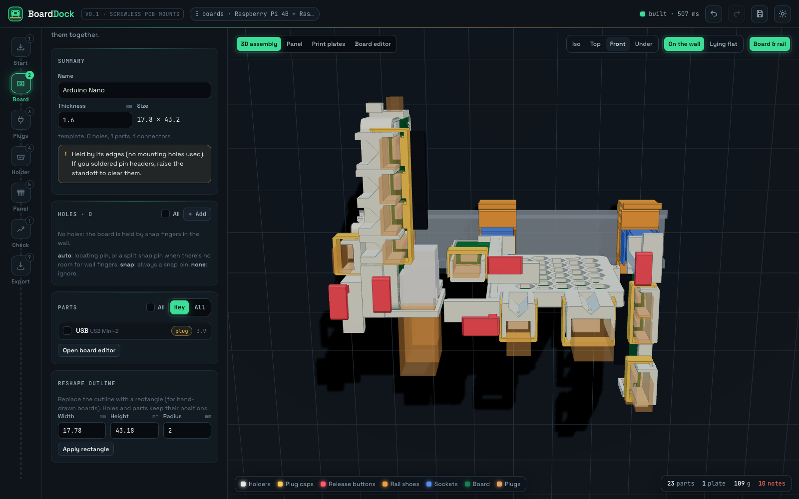

# BoardDock

**Dock any PCB. No screws. No supports.**

BoardDock turns a PCB design, or a few measurements, into 3D-printable holders:
- It fits each holder around the board's parts, holes and plugs.
- It docks every holder onto DIN rails, horizontal or vertical.
- It turns each board so every plug stays reachable.
- A push-button on top of each holder releases the board.

Everything is checked with FEA and packed onto as few print plates as possible.


- **Imports:** KiCad, Altium (via STEP or Gerber), Eagle, IDF, DXF and Gerber + drill + pick-and-place.
  - You can also draw a board by hand or start from a template.
- **Fits holders automatically:**
  - Standoffs, and snap pins in the mounting holes.
  - Snap fingers in the walls.
  - Clearance for the board's underside.
  - Openings for every plug.
- **Protects plugs:** each connector gets a cradle that carries the mating plug's body, so a knocked cable loads the holder, not the solder joints. A snap-on cap locks the plug in.
- **Builds panels:**
  - Any number of rails, each horizontal or vertical.
  - Docks that turn four ways and take two boards back to back.
  - Flat clips for boards that should lie against the wall.
  - All laid out automatically, then editable by drag, turn, swap and multi-select.
- **Checks:** hand calculations for every snap, plus 2D FEA of the dock's springs (the socket latch and the rail shoe hinge) for your material.
- **Exports** binary STL or 3MF, one file per print plate, packed onto your printer's bed.
- **Open source** (MIT). It runs in the browser or as a desktop app for Windows, macOS and Linux.

## Download

| | |
|---|---|
| **Desktop app** | [Releases](https://github.com/danmover/boarddock/releases): Windows installer or portable `.exe`, macOS `.dmg`, Linux `.AppImage` / `.deb` |
| **Web app** | [danmover.github.io/boarddock](https://danmover.github.io/boarddock) (nothing is uploaded; all processing runs in your browser) |
| **From source** | `npm install` then `npm run dev` (see [Development](#development)) |

The desktop builds are not code-signed yet:
- On **macOS**, right-click the app and choose **Open** the first time.
- On **Windows**, choose **More info → Run anyway**.

## Quick start

1. **Start:** drop your board files (or a zip) anywhere in the window, or pick a template.
   - To add more boards, tick **Add as another board**.
2. **Board and Plugs:**
   - Check the outline, holes and parts; fix anything in the board editor.
   - Pick the plug type and size for each connector.
3. **Panel:** BoardDock has already placed every board on a rail. Drag, turn or pair them if you like.
4. **Check:** read the notes and run the dock FEA for your material.
5. **Export:** download the plates and print them in PETG. Cut a TS35 rail to the length shown.


## The dock

Every board sits in a holder that plugs into a dock on the rail. This is the screwless "DIN hub" design, built into the generator:

| Part | What it does | Prints |
|---|---|---|
| **Rail shoe** (orange) | Clips onto a TS35 rail. **To remove it:** push the thumb lever beside the socket toward the dock and tilt the dock off. A stop stops the hinge from being over-bent. | on its end face |
| **Socket** (blue) | Snaps into the shoe in any of four 90° turns and takes two holders back to back. It has two print-in-place latches. | on its end face |
| **Holder** | The tray around your board, with a tongue on its dock edge and a spine that carries the release rod. | flat on its back |
| **Release rod** (red) | Its head is the **button on the holder's top edge**. Press it and the rod's 45° foot wedges the latch open. The latch spring returns it. | flat |

**Using it:**
1. Hook the shoe under the rail and press it down until it clicks.
2. Press the socket in, in whichever turn you want.
3. Push the holder straight down into the socket until the latch clicks.
4. **To take a board out:** put your thumb on the red button and two fingers under the grip bar, squeeze, and lift.

**Where the release goes:**
- When the top edge of the board is free, the spine runs under the board. The board is lifted about 10 mm to clear it.
- When the top edge is crowded with plugs, as on a Raspberry Pi, the spine, grip bar and button move beside the board and reach away from it. The plugs stay clear and the board stays low.


## The panel


The **Panel** step shows the wall from the front: rails, docks, and every board's footprint. Arrows show where each board's plugs point:

| Mark | Meaning |
|---|---|
| **◉** | faces you |
| **✓** | points along the panel, where cable ducts usually run |
| **⚠** | points at the next dock on the rail |
| **✕** | points into the wall |

**Auto-arrange** (on by default):
- Tries every dock edge and all four turns for each board, and picks the one with the best plug access.
  - It never lets a plug face the wall.
  - It keeps the release button clear of plugs, and prefers boards that stick out less.
- Pairs boards back to back in one dock when that costs nothing in plug access.
- Packs the docks along the rail using their real 3D size, including plugs, cradles and buttons.
- Starts a new rail when one gets longer than your limit.
- Settings: rail direction, longest rail, gap between docks, space between rails, and pairing on or off.

**Editing by hand.** The first edit keeps everything where it is and switches to manual.

| Action | How |
|---|---|
| Move a dock along its rail | drag it, or use the arrow keys (Shift = 10 mm) |
| Move a dock to another rail | drag it onto that rail |
| Move a rail | drag the rail |
| Turn a dock 90° | **R** (Shift+R turns the other way) |
| Swap front and back boards | **F** |
| Select several docks | Shift-click, or drag a box; ⌘A selects all |
| Remove | Delete |
| Put a board on the panel | drag it from the board list onto a rail (new dock) or onto a dock (shares it back to back) |

The inspector sets:
- dock or flat clip;
- turn, with a picture of each turn;
- rail and position;
- the board in each slot;
- which board edge goes into the dock, or Auto;
- rail direction, position and length (fixed, or cut to fit).

**Overlaps** between neighbours are hatched red. The Check step lists the rails to cut and how far the panel stands off the wall.



## Supported files

| Source | What to export | What BoardDock reads |
|---|---|---|
| **KiCad** 6–9 | the `.kicad_pcb` file | outline (lines and arcs), holes, footprints with courtyard sizes, top and bottom parts |
| **Altium Designer** | *File → Export → STEP 3D*, or Gerber + NC drill + pick-and-place | STEP: board outline, holes and part bodies. Fab files: outline, holes, parts. |
| **Fusion 360 / Eagle** | the `.brd` file, or STEP | outline, holes, packages |
| **EasyEDA / JLCPCB** | Gerber zip + CPL (pick and place) | outline, holes, parts |
| **Any EDA tool** | IDF 3.0 (`.emn` + `.emp`) | outline, cut-outs, holes, part outlines and heights |
| **Mechanical drawing** | DXF | outline and round holes |
| **No files** | draw it, or start from a template (Raspberry Pi 4 / Zero / Pico, Arduino Uno / Nano, perfboard) | |

Connectors are recognised by footprint name: USB-C, micro and mini USB, USB-A and B, HDMI, RJ45, barrel jacks, 3.5 mm audio, microSD, SMA, Qwiic, terminal blocks, JST and pin headers. Each one gets a plug size you can change.

Altium `.PcbDoc` files use a proprietary binary format. Export STEP or fabrication files instead; BoardDock explains this if you drop one in.

## Loose holders

Choose **Loose holders** in the Panel step for holders without a rail dock:
- **stacked** on corner towers with press-fit pegs;
- **side by side** with printed link bars;
- **back to back** with snap rivets.

Each holder can also have a flat pull-tab DIN clip or a **stand socket** (round, square, hex or D-shaped post, or a 1/4"-20 tripod nut trap).

| Stacked | Side by side |
|---|---|
|  |  |

## Checks and FEA


The FEA is 2D plane stress:
- **Elements:** incompatible-mode quads, validated against beam theory in the test suite.
- **Mesh:** square pixels, 0.1 mm (or 0.06 mm with the fine option).
- **Scaling:** each case is solved for a unit load and scaled to the travel it has to reach.

PETG results (E = 2100 MPa, strain limit 2%):

| Case | Force | Peak strain | 99% of the part below |
|---|---|---|---|
| Latch: holder pushed in (nose moves out 1.3 mm) | about 10 N push | 1.6% | 1.0% |
| Latch: button pressed (nose clears the groove after 1.9 of 3.1 mm) | 3.2 N | 1.2% | 0.8% |
| Rail shoe: thumb lever (jaw opens 1.7 mm, 2.1 mm of lever travel) | 3.2 N | 1.7–1.9% | 0.5% |
| Rail shoe: pressed onto the rail | 4.5 N | 1.6–1.8% | 0.5% |
| Rail shoe: 100 N pull away from the wall (held by friction) | reaches the strain limit at about 53 N | 3.8% at 100 N | 0.6% |

**Two design changes came out of this analysis:**
- **Hinge leaf:** the original design tapered the rail shoe's hinge leaf from 0.84 to 1.14 mm. That suits clipping onto the rail, but the thumb lever pushes from above the hinge, so its bending peaks at the thin end. BoardDock uses a uniform 0.9 mm leaf (two 0.45 mm lines), which cut the release strain from about 2.7% to 1.9%.
- **Pull-off:** a straight pull tends to open the jaw, because the hinge sits outboard of the lip. Friction on the flange holds it: about 0.2 is needed, and PETG on steel is usually 0.3 to 0.5. Keep heavy cables supported. Moving the hinge above the lip is the next design step.

## Printing

- **Material: PETG.** Every dock part is a spring. PLA is stiffer and more brittle, so strains that are fine in PETG are marginal in PLA. The Check step judges each part against your material's limit.
- **Supports: none.** Overhangs are 45° chamfers or short bridges, round holes on their side are teardrops, and all springs flex within their print layers.
- **Plates:** each plate becomes one STL or 3MF file with every part already placed. The estimate shows grams and print time per part.
- **First print:** print one dock (shoe, socket, one holder and its rod) before a batch, to check the fit on your printer.

## Honest limits

- Nothing here has been physically printed and tested yet. Fits, snap forces, creep and fatigue all depend on your printer and filament.
- The FEA is linear, 2D and idealised. It has no contact, friction or print anisotropy, and its peaks sit at pixel-mesh corners. Treat it as a comparison between designs, not a guarantee.
- The rail shoe's pull-off hold relies on friction, as described under [Checks and FEA](#checks-and-fea).
- Template boards come from the manufacturers' drawings; check yours. Imported part heights are only as good as the source (IDF and STEP are best).
- A large board docked by one tongue feels a sizeable lever when you plug in a stiff cable at the far end: the Check step lists the tongue stress. Hold the holder while you plug in.

## Development

```bash
npm install
npm run dev          # web app at http://localhost:5173
npm test             # vitest: importers, holders, panels, dock FEA
npm run typecheck
npm run build        # production web build in dist/
npm run desktop      # Electron app from the build
npm run dist         # installers for the current OS in release/
```

**Project layout:**

- `src/import/`: KiCad, Gerber, Excellon, pick-and-place, IDF, Eagle, DXF and STEP importers.
- `src/cad/`: geometry.
  - `generate.ts`: the holder around one board.
  - `dock.ts`: rail shoe, socket, tongue, spine and rod.
  - `dockplan.ts`: plug access, orientation and auto-assignment (no geometry kernel).
  - `panelgen.ts`: the panel (placement, rows, collisions, parts).
  - `assembly.ts`: loose layouts.
  - `export.ts`: STL and 3MF output, plate packing.
- `src/fea/`: 2D solver (`fea2d.ts`), the flat clip (`clipfea.ts`) and the dock (`dockfea.ts`).
- `src/ui/`: React UI, including the board editor (`BoardEditor.tsx`) and the panel editor (`PanelEditor.tsx`, `PanelSide.tsx`).
- `src/worker/`: geometry and FEA run in web workers.
- `electron/`: desktop shell.
- `.github/workflows/`: CI, and a release job that builds installers for all three platforms and publishes the web app.

Geometry uses [manifold](https://github.com/elalish/manifold) (WebAssembly), which always produces watertight, printable meshes.

## Licence

MIT for BoardDock itself; see [LICENSE](LICENSE). Third-party components and their licences are listed in [NOTICE](NOTICE).
